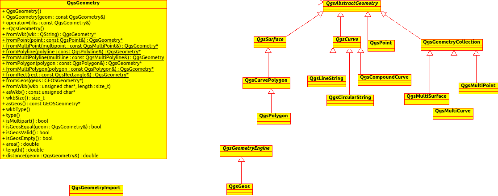

.. _qep#[.#]:

========================================================================
QGIS Enhancement 8: Geometry redesign
========================================================================

:Date: 2014/10/30
:Author: Marco Hugenobler
:Contact: marco at sourcepole.ch
:Last Edited: 2014/10/30
:Status:  Draft
:Supercedes:
:Version: QGIS 2.7
:Sponsor: Canton of Solothurn, Switzerland
:Sponsor URL:

.. note::

    See :ref:`QEP 1 <qep1>` for description of QEP process.

1. Summary
----------

The mmsql geometry standard describes some features not supported by the current geometry class:
* Curved geometries (circles)
* Compound types (compoundcurve, geometrycollection)
* Z-coordinates
* M-coordinates (e.g. used for linear referencing)

This QEP proposes a redesign of the geometry system to support these features. As a positive side effect, the code should be more flexible and easier maintainable (e.g. possibility to add new geometry types likes splines).

2. Possible Applications
------------------------

The following examples come to my mind (surely there are more):

1. In Switzerland, circular arcs and compound types (compoundcurve, curvepolygon) are important in public data like cadastral surveying data . These types are already supported in PostGIS, and work is underway to support it in OGR as well. In order to be able to see and edit this data, it is a logic step to support it in QGIS too.

2. It is common to have 3D data in PostGIS. Currently, depending on the edit method used, it can happen that QGIS converts a geometry to 2D during editing. QGIS should at least preserve the existing z-Values if possible (e.g. if a vertex is moved to a new position). To achieve that, it needs an internal geometry representation that supports z-values. Maybe we will see more 3D plugins if storing z-coordinates is supported by the core library.

3. Linear referencing is an important feature to avoid redundancy for geographic data. Currently, it is done with a hack in shapefile reading and evaluated in the analysis library (using event layer plugin as GUI). If the geometry model supports m-values, linear referencing can be solved properly and for all datasources which support m-values.

3. Proposed solution
------------------------

It is proposed to build a class hierarchy according to the mmsql iso standard with QgsAbstractGeometryV2 as the base class. Working with inheritance, it will be straightforward to support nested types, like compoundcurve or geometry collecion. As the current geometry class is used in so many places in QGIS, it is proposed to keep the interface QgsGeometry and direct the calls to it to a new geometry object. This means that existing code should just continue working while offering the new possibilities.

For editing, it is planned to adapt the 'add feature' tool with the possibility to digitise circular arcs and to adapt the node-tool with the  possibility to modify start/end/midpoints of circular arcs.

For geometry analysis and some edit methods, QGIS uses the geos library. As geos does not support circular arcs, curved geometries are segmentised if using one of those methods.

4. Implementation details
--------------------------

The UML diagram of the proposed solution contains the following elements:

- QgsGeometry has the same API as the current class. Internally, it holds a pointer to the new geometry class and redirects calls to it. To avoid performance overhead, QgsGeometry uses implicitely sharing. 
- QgsAbstractGeometryV2 is the base class of the new geometry classes. Instantiable classes are QgsPointV2, QgsLineStringV2, QgsCircularStringV2,QgsCompoundCurveV2, QgsCurvePolygonV2, QgsPolygonV2, QgsGeometryCollectionV2, QgsMultiPointV2, QgsMultiSurfaceV2, QgsMultiCurveV2
- QgsVectorTopology / QgsGeos handles analytical operations like buffer/union/intersection, etc. as well as import/export between geometry classes and geos. All this code is separated from the geometry classes now. The API has been further extened to prepare a geometry for better performance in case of repeaded topological operations.

4.1 Changes in rendering
-------------------------
To decouple the rendering from the geometry system, each geometry class provides the methods 'transform( QgsCoordinateTransform )', 'mapToPixel( QgsMapToPixel )', 'draw( QPainter )'. So normal symbol layers don't need to query / transform the geometry anymore. Symbol layers with a very special geometric behaviour can still call QgsGeometry::convertToStraightSegment() and work like now.

One difference to the current code is that the geometry is changed in place during rendering. QgsFeatureRendererV2::renderFeature(...) transforms the geometry of a feature into pixel coordinates. I think this is ok, because QgsFeature is not a const argument. So the caller cannot assume there is no change to the feature.

5. Performance implications
----------------------------

First tests indicate that the rendering performance can be similar to the current state (2.6). It is planned to do some testing with qgis_bench to avoid performance regressions. It will however be impossible to test all possible rendering option.
