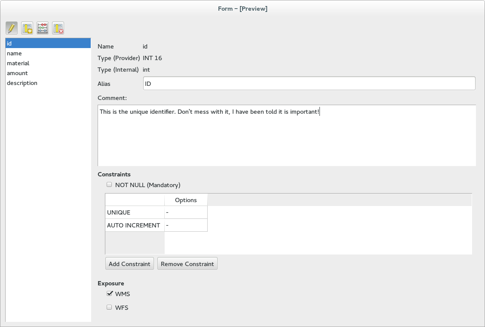
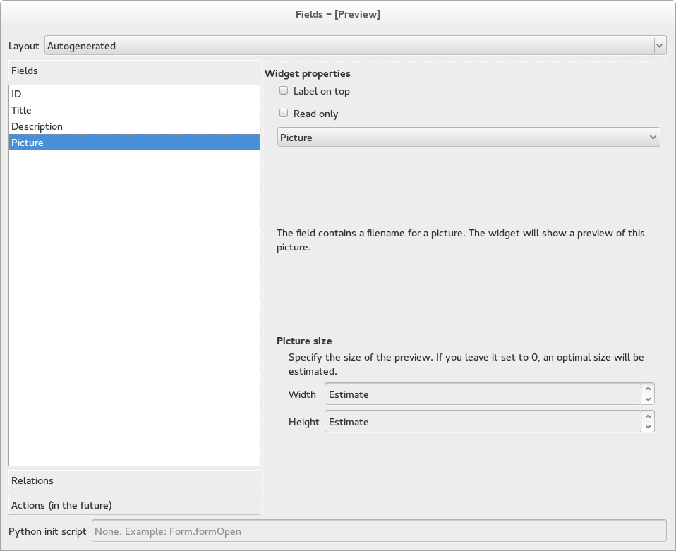
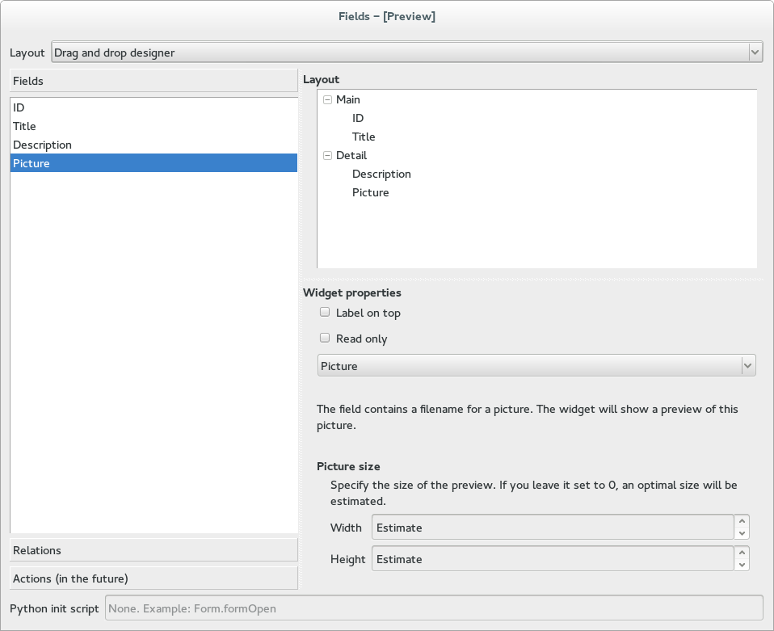
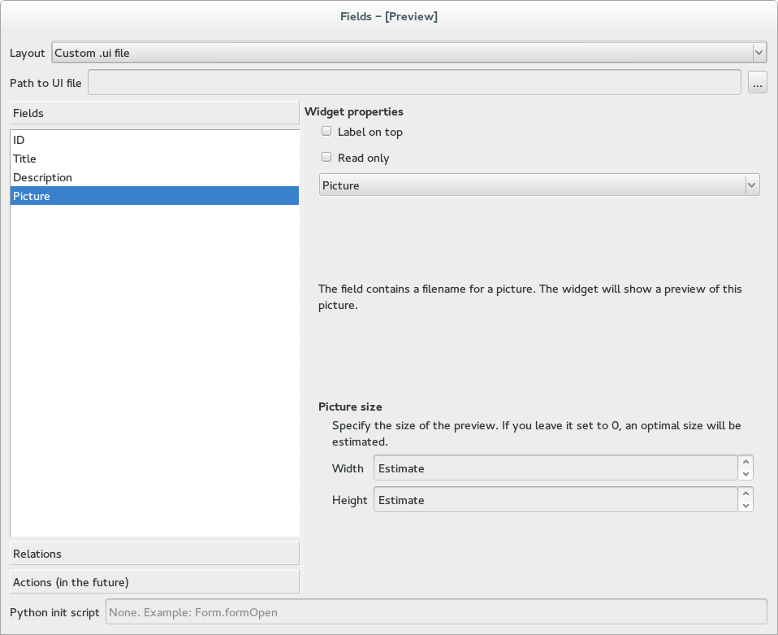

.. _qep#[.#]:

========================================================================
QGIS Enhancement #: Fields And Forms Redesign
========================================================================

:Date: 2014/11/25
:Author: Matthias Kuhn
:Contact: matthias dot kuhn at gmx dot ch
:Last Edited: 2014/11/25
:Status:  Draft
:Version: QGIS 2.8

1. Summary
----------

The tab *Fields* on the vector layer properties dialog should be split into
two different tabs that separate data-related from form- and widget-related
user interface elements.
This is expected to improve user experience and usability.

2. Rationale
----------

On the vector layer properties dialog there is a tab *Fields* where the user is
able to configure different things related to fields (data- and widget-related)
and forms (data- and form-related):

- The general layout of the form (autogenerated, drag and drop, ui file)
- The appearance of the individual widgets

  + Some weak constraints can be introduced that will limit acceptable input
    from widgets but will not be enforced by any other way to set a field's
    value (e.g. min/max values from the range widget)
    
- Adding fields and removing fields
- Drag and drop fields and relations to the form
- Python logic

This tab currently is in a very bad shape from a UX perspective. Problems
include:

- Having to scroll horizontally in the fields table when wanting to change
  the widget type or looking for information.
- The resizable containers on the right and at the bottom can be hidden
  (consciously and unconsciously) and confuse the user.

3. Proposal
-------------

The information and functionality that is now available on the _Fields_ tab
will be split and put on two different tabs:

- Fields
- Form

3.1 Fields
.................

The *Fields* tab conatins anything that is related to data and fields.

In particular, this refers to:

- Changing fields

  + add
  + delete
  + calculate

- Information about fields

  + data type
  + comment
  + constraints (Future)
  + domain (Future)
  + exposure (WMS/WFS)
  + ...

Mockup
~~~~~~~~~~~~~

   
   Mockup of the fields tab. This will be shown embedded in the vector layer properties dialog.

3.2 Forms
.................

The *Form* tab contains anything that is related to user interface and visual
representation and manipulation of a features fields.

In particular, this refers to:

- The widget type
- The widget configuration
- Form layout
- Python init script for the form
- ...

Mockups
~~~~~~~~~~~~~

   Mockup of the *Form* tab with autogenerated layout. This will be shown embedded in the vector layer properties dialog.

   Mockup of the *Form* tab with drag and drop designer layout. This will be shown embedded in the vector layer properties dialog.
   

   Mockup of the *Form* tab with ui file layout. This will be shown embedded in the vector layer properties dialog.
   
4. Scope
-------------

Weak constraints are currently defined in the widget properties. It is outside the 
scope of this QEP to move constraints to the fields tab. The sole purpose of the 
constraints part of the UI in the mockups is to highlight where I immagine this could
eventually lead to.
For the moment, the currently available weak constraints will still be defined on
the *Form* tab.

5. Documentation
-------------

Documentation would need to be updated to suit.

6. Voting History
-------------

(required)
