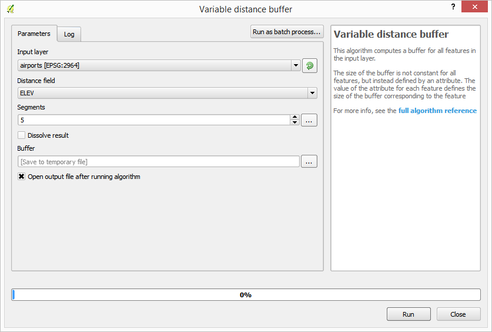

.. _qep#[.#]:

========================================================================
QGIS Enhancement #: Processing UI/UX Improvements
========================================================================

:Date: 2015/10/23
:Author: Victor Olaya
:Contact: volayaf at gmail dot com
 
:Last Edited: 2015/10/23
:Status:  Draft
:Version: QGIS 2.14

Summary
----------

This QEP proposes improvements in the Processing UI to make it more intuitive and less confusing for users 

Rationale
-------------

Processing is a complex tool and it features a large number of elements. This can be indimidating for some users and rather confusing.

To avoid this, a simplified interface was proposed, in which algorithm providers are not shown, and a single "Geoalgorithms" category is added to the toolbox. Not all algorithms are added under that group, but just a selected group of them, and certain algorithms are renamed. 

This has proven to be a bad solution. Users are more confused, and when they find out that some algorithms are in the advanced mode but not in the simplified one, they report that as a bug. Mantaining the simplified interface is also a concern, since sometimes new algorithms are added but the corresponding entry for the simplified version is not added. That causes the algorithm to not be available in the simplified interface.

Additional problems have been reported, such as the lack of help. This QEP proposes some simple enhancements that might help aliviate that. 

Overall, the idea is to make Processing easier to understand. This QEP does not include any new analytical feature or similar improvement.

Proposed Change
-----------------------------------------

The following changes are proposed:

- Eliminate the simplified interface. Instead, the normal interface will be displayed all the time. To make it more friendly, only the "QGIS algorithms" will be enabled by default. A tip box on top of the toolbox might be added, telling first-time users that they can add more algorithms by enabling additional plugins.

- Only show duplicated algorithms if the users explicitly selects that option. Some functionality is repeated, due to several backends having similar algorithms (for instance, there is a slope algorithm in GDAL, SAGA and GRASS). While those algorithms are not identical (and for this reason it is worth keeping all of them), this confuses most users. To avoid that, groups of similar algorithms will be identified, and only one of them will be selected as the main one to be added to the toolbox. The remaining ones will be labeled as alternatives. In the Processing options, a new option will be added to enable showing all alternatives, in case an advanced user wants to do so.

- Add a small help panel to the algorithm dialog. Currently, the algorithm panel has a help tab. This has two problems: the first one is that help is not seen inmediately after opening the dialog. The second, and most important one, is that the help is lacking for most algorithms, and a help template with parameter names is shown instead.

	Writing help files for all algorithms is a very long task, and we have not been succesful at it. It looks like full description of algorithms will not be available anytime soon. Instead of waiting for that and maintaining the help tab for a detailed algorithm content, a smaller panel is proposed. It would be placed in the side of the algorithm dialog, and it would display a short description of the algorithm. Having such a description for most algorithms (or at least for the ones in the "QGIS algorithms" group) is much more realistic and feasible. For those algorithms that have a full help file, a "more info" link can be provided, which would open the corresponding page in the QGIS documentation.

See the picture below for an example

Backwards Compatibility
--------------------------

Since the change is only cosmetic, it wouldn't have any effect on analysis features themselves, and would not break models or scripts from previous versions

