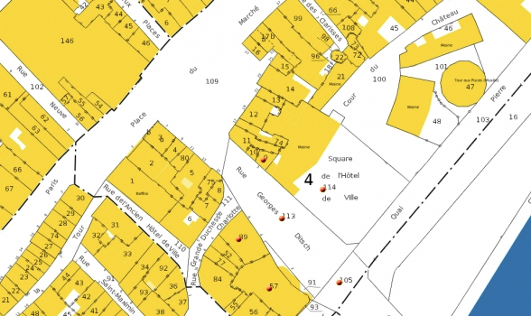
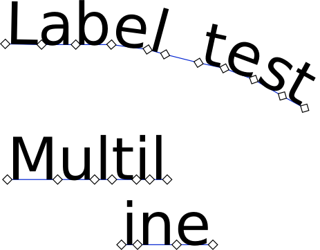

.. _qep#[.#]:

========================================================================
QGIS Enhancement ??: Label annotations
========================================================================

:Date: October 2015
:Author: Hugo Mercier
:Contact: hugo dot mercier at oslandia dot com
:Last Edited: 
:Status:  
:Version:

Summary
-------

A high level of refinement for manual label placement maybe required for some users, when words or even letters of a label have to be placed precisely for example.

We propose to rely on label paths (see QEP on label paths) to implement this feature.

Proposed solution
-----------------

Here is a map with labels where such a free placement feature would be useful :

For such advanced labeling needs, where the user may want to place every word precisely, we propose to model it thanks to a label path.

This will only be available for labels that have a size expressed in fixed map units. It does not make sense to precisely place glyphs of a label
if letters of this label have a size dependent on the current zoom factor.

This kind of label path is represented by a multi-linestring. Each linestring of the multi-linestring is a line where part of the text
may be placed.

Each segment of a linestring represents a position and angle for one glyph of the label letters.

Since such representation is very low-level and hard to handle for the end users, tools will help to create lines where the final label
will be drawn for common scenarios (a multi-line paragraph). For more advanced uses, the underlying multi-linestring will be available
for modification by the end user.

Core Changes
------------

An option to the labeling options, "Place label glyphs on the segments of the label path" will be added.

A helper function that outputs a multi-linestring of glyph placement for a multi-line paragraph (based on litterature on word wraping algorithms)
will be added.

The labeling engine will be modified to draw these annotations directly, out of the global optimization. The glyphs will still be considered
as obstacles for other automatically placed labels.

GUI Changes
-----------

New GUI tools will be added to the labeling toolbox.

- A tool to draw the label in a (multi-line) paragraph. When enabled, the tool will allow the user to draw a box with the mouse. A dialog will then
be shown to set the line and word-breaking options (word and letter spacing, etc.)

- A tool to manually edit the label path of a label. Digitizing tools of linestrings will be reused for this task.

Further considerations
----------------------

Other helper functions could be added in the future, like a tool that outputs the medial axis of a polygon as a label path
(for the labeling of large streets for instance)

Voting History
--------------

