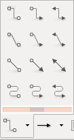
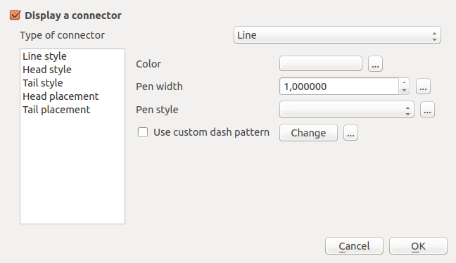

.. _qep#[.#]:

========================================================================
QGIS Enhancement ??: Label connectors
========================================================================

:Date: October 2015
:Author: Hugo Mercier
:Contact: hugo dot mercier at oslandia dot com
:Last Edited: 
:Status:  
:Version: QGIS 2.14

Summary
-------

This proposal is aiming at adding to the labeling display engine the possibility for the user to define
"connectors" between labels and the features they label.

Current state
-------------

The current (2.11) version of QGIS allows to manually place labels when the output of the automatic placement mechanism is not enough.

It relies on "data defined" properties. Indeed, the X and Y positions of a label as well as its rotation angle can be defined by a data column or any
expression.

Some graphical controls allow then to manually manipulate these properties. The state of a label can changed from being automatically placed by being
manually placed (pinning/unpinning). When they are pinned, labels can then be moved or rotated by interaction of the user. Positions and rotations
data are then updated in columns of the layer.

Proposed improvements
---------------------

It may be desirable to have visual "connectors" between the label and the feature it refers to. They are a generalization of "arrows", as it
can be found in drawing programs: single arrows, straight lines or curves. Connectors are "attached" to a label: if one of the two endings
(either the label or the feature) is moved, the shape of the connector is recomputed and a display refresh is needed.

This QEP is not meant to give an exhaustive list of possible connectors. The idea is to have a generic implementation with the most common
types of connectors and everything needed in the code to be able to add new types in the future.

Possible types of connectors:
- a straight line
- two connected straight lines, with an horizontal part and a free part
- three connected straight lines, with two horizontal parts and a vertical part
- a curve with one bending point
- a curve with two bending points

To draw the connectors additional properties (aside X and Y position) are needed like:
- style of the line (plain, dotted, dashed, etc.)
- thickness of the line
- color of the line
- presence of arrow heads on both ends
- style of the arrow heads
- size of the arrow heads (absolute or relative)
- color of the arrow heads

Placement of the two ends also need additional properties:
- position of the ending on the side of the label : up, down, right, left, center, etc.
- position of the ending on the side of the feature:
  - for points: no particular option, it targets the point in itself
  - for lines: beginning, middle, center
  - for polygons: centroid of the polygon or on the border

Certain types of connectors may also need specific properties like coordinates of the control points for curves (Bézier or B-splines). Coordinates
of control points can only be data-defined or defined by 'null' which will make the display engine use 'best' coordinates.

Implementation details
----------------------

Connectors are drawn to the Qt canvas, using the QPainter API. In order to be able to reuse the drawing code in other parts (possibly in a new symbology for lines), some
classes will be designed.
These classes are composed mostly of read/write properties with a central method aiming at doing the actual drawing with a render context.

QgsConnectorRenderer

lineStyle
lineColor
headStyle
headColor
tailStyle
tailColor
isCurved
void render( point[], renderContext )

In the current code base, the following methods would be modified:
- QgsPalLabeling::drawLabeling() : extract necessary property values and data-defined values for connectors
- new method drawConnector, similar to drawLabel that will instanciate a QgsConnectorRenderer and call render

GUI Changes
-----------

The labeling part of the "properties" dialog of a layer will need a new entry for connector-related properties. These properties
will be available only if X and Y positions are data-defined (i.e. manual placement).

Each of the property could also be data-defined (not represented here).

From the user perspective, new tools will be available to easily manipulate label connectors. To be consistent with current label manual placement toolboxes,
new controls will be added to manually place control points for connector types that need them.

Optionaly, it would be nice for the user to be able to edit per-connector properties, i.e. properties that are data-defined via a GUI dialog. This could
be achieved by reusing the connector properties dialog and connecting it to one particular feature.

