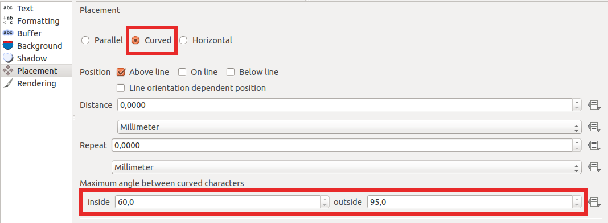

.. _qep#[.#]:

========================================================================
QGIS Enhancement ??: Labeling path
========================================================================

:Date: October 2015
:Author: Hugo Mercier
:Contact: hugo dot mercier at oslandia dot com
:Last Edited: 
:Status:  
:Version:

Summary
-------

A new labeling option is proposed for addition here. It allows to use a user-defined linear path for the drawing of a label.

Using a simplified path for the curved placement of labels is one of the possible use cases of such a feature.

A user-defined path can be seen as an additional geometry on a layer, where the underlying model supports only one "geometry column".

Proposed solution
-----------------

We propose the add a way for the user to use a different geometry object as support for the "curved" placement of a label.

The current (2.11) version of QGIS allows to display labels along the linestring features in a "curved" manner.

However for linestrings defined with lots of control points (such as waterways) or with high curvatures, displaying correct
labels can be either unesthetic or very slow.

This is where using a path slightly different from the feature's geometry could be useful. For instance using a simplified version
of the linestring could lead to a label faster to display or with smaller curvatures.

We then propose to allow the "curved" placement to use an arbitrary geometry, through a data-defined "label path" property. The data-defined
property could point to a user-defined column or to an expression.

We also propose to add a "simplify()" function in core expression functions for that purpose.

This option for placement along a user-defined path would also be useful for other types of features, like points and polygons.

Core Changes
------------

A new data-defined labeling property of type QgsGeometry is added for the definition of the label path ("labeling/dataDefined/labelPath").
QgsPalLayerSettings::registerFeature will be modified in consequence: if this new property is set and curved placement is enabled, it will be used as a support.

GUI Changes
-----------

A new tool will be available in the labeling toolbox. This tool will allow to draw a user-defined label path. It will be enabled only if the
label path property is defined from an editable field (not an expression).

Performance Implications
------------------------

For the use case presented above, where the user wants to use an expression like "simplify($geometry)" as a label path, computing the simplification of the
feature's geometry each time the label is drawn could be time consuming.
Enabling cache on an expression field for the label path (see QEP on auxiliary fields) may be used to resolve this performance issue.

Test Coverage
-------------

Unit tests will be added to the core part to ensure the label path feature works correctly.

Voting History
--------------

