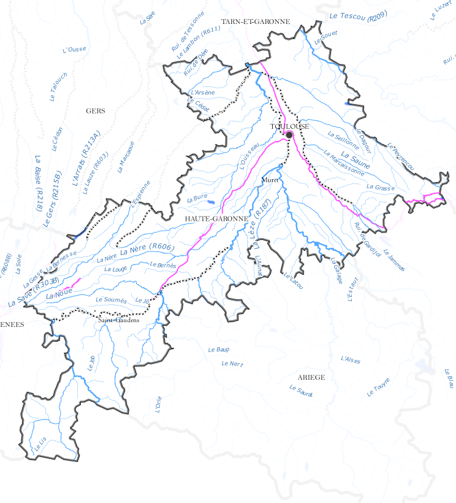
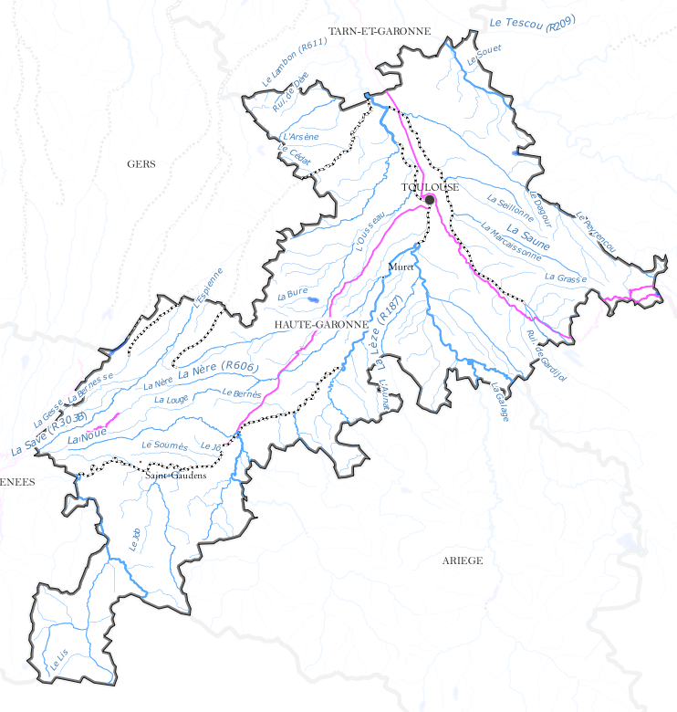

.. _qep#[.#]:

========================================================================
QGIS Enhancement ??: Label mask
========================================================================

:Date: October 2015
:Author: Hugo Mercier
:Contact: hugo dot mercier at oslandia dot com
:Last Edited: 
:Status:  
:Version:

Summary
-------

This QEP is about the integration of a special kind of vector layer which serves as a mask for the labeling engine.

Thanks to symbology options like "inverted polygon fill" and/or "shapeburst fill", it is possible with the current QGIS version to display
maps where some parts are "highlighted", because the uninteresting parts have been masked out.

However it may be desirable to also mask labels of the parts without much interest.

Here we can see that some labels are chosen to still be displayed (name of the departments), but other are filtered out by the mask.

Legend items should also be filtered out if they are currently masked.

Proposed solution
-----------------

We propose to add a new special kind of vector layer that will be used to carry the current mask geometry.
This is a vector layer with some contraints:

- it can only be a polygon
- there is no attribute
- there is only one feature in it, the current mask geometry
- there cannot be more than one mask layer in a project

Core Changes
------------

A new type of map layer will be added: QgsMaskLayer inherited from QgsMapLayer. It access a mask geometry that is stored as a global property of the project (through either a QgsProject custom
property for instance).

Creation of the a new mask layer will be refused if there is already one created (or the existing will be used, if possible).

A new labeling property will be available for each vector layer to use or ignore the mask geometry as an obstacle for the automatic placement of labels.

GUI Changes
-----------

Functions will allow to easily convert a selection from a polygon layer to the mask layer. When multiple polygons are selected, the resulting mask geometry is the geometric
union of all the polygon selections.

The mask layer, if present appears in the legend tree of the mapcanvas, with a specific icon.
It can be manipulated (moved up and down) like any other layers. It acts as a polygon layer.
Its fill style can then be set.

A new labeling property will be available for each vector layer that will allow to use the mask geometry as an obstacle.

A new toggle button in the legend will allow to filter out items if they are outside the mask.

Atlas integration
-----------------

The mask layer will be usable by the atlas generation function of the map composer so that the mask geometry will be set to the current atlas feature's geometry.

Voting History
--------------

