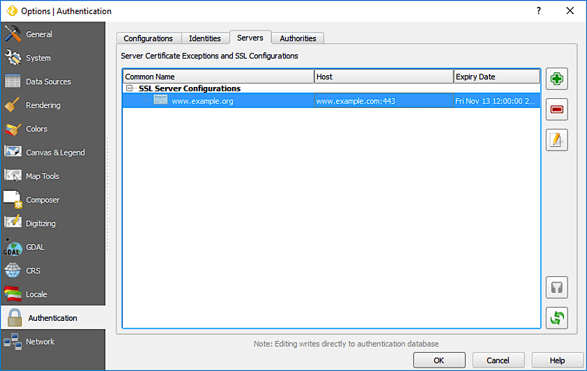

********************************************
Boundless QGIS with PKI - User Documentation
********************************************

This document details the process of configuring and using a Boundless QGIS with PKI.  It was deemed up-to-date as of October 2015 for QGIS v2.8.3.

Background
==========

Boundless has released a build of QGIS with an enhancement that adds the ability to authenticate remote services via PKI certificate. PKI certificate authentication is part of a new application-wide authentication system. Previously, QGIS had no support for encrypting sensitive credentials, or even any authentication method beyond a simple user's name and password.

QGIS Authentication System
==========================

Overview
--------

The new authentication system stores authentication configurations in an SQLite database file located, by default, at::

  <user home>\.qgis2\qgis-auth.db

This authentication database can be moved between QGIS installations without affecting other current QGIS user preferences, as it is completely separate from normal QGIS settings.

A configuration ID (a random 7-character alphanumeric string) is generated when initially storing a configuration to the database. This represents the configuration, thereby allowing the ID to be stored in plain text application components (such as project, plugin, or settings files), without disclosure of its associated credentials.

To store or access sensitive information within the database, a user must define a **master password**. A new master password is requested and verified when initially storing any encrypted data to the database. Only when sensitive information is accessed is the user prompted for the master password, which is then cached for the remainder of the session (until application is quit), unless the user manually chooses an action to clear its cached value.

   Setting a new master password

Some instances of using the authentication system do not require input of the master password, such as when selecting an existing authentication configuration, or applying a configuration to a server setup (such as a WMS connection).

   QGIS authentication workflow

Managing the Master Password
----------------------------

Once set, the master password can be reset; the current master password will be needed prior to resetting. During this process, there is an option to generate a complete backup of the current database.

   Resetting the master password

If the user forgets the master password, there is no way to retrieve or override it. There is also no means of retrieving encrypted information without knowing the master password.

If a user inputs their existing password incorrectly three times, the dialog will offer to erase the database.

   Password prompt after three invalid attempts

Managing PKI Components in the Authentication Database
------------------------------------------------------

When configuring PKI components within the authentication system, you have the option of importing components into the database or referencing component files stored on your filesystem. The latter may be useful if such components change frequently, or where the components will be replaced by a system administrator. In either instance you will need to store any passphrase needed to access private keys within the database.

All PKI components can be managed in separate editors within the **Authentication** section in the QGIS **Options** dialog, which can be accessed via the **Settings --> Authentication** menu.

   Opening the Authentication settings

There are editors for **Configurations**, **Identities**, **Servers** and **Authorities**. Each of these are contained in their own tabs, and are described below in the order they are encountered in the workflow chart above. The tab order is relative to frequently accessed editors once you are accustomed to the workflow.

.. note:: Because all authentication system edits write immediately to the authentication database, there is no need to click the Options dialog **OK** button for any changes to be saved. This is unlike other settings in the Options dialog.

Authorities
...........

You can manage available Certificate Authorities (CAs) from the **Authorities** tab in the **Authentication** section of the QGIS **Options** dialog.

As referenced in the workflow chart above, the first step is to import or reference a file of CAs. This step is optional, and may be unnecessary if your PKI trust chain originates from root CAs already installed in your operating system (OS), such as a certificate from a commercial certificate vendor. If your authenticating root CA is not in the OS's trusted root CAs, it will need to be imported or have its file system path referenced. (Contact your system administrator if unsure.)

   Authorities editor

By default, the root CAs from your OS are available; however, their trust settings are not inherited. You should review the certificate trust policy settings, especially if your OS root CAs have had their policies adjusted. Any certificate that is expired will be set to untrusted and will not be used in secure server connections, unless you specifically override its trust policy. To see the QGIS-discoverable trust chain for any certificate, select it and click the Info button (blue circle with white lower-case "i").

   Certificate info dialog

You can edit the trust policy for any selected certificate within the chain. Any change in trust policy to a selected certificate will not be saved to the database unless the Save button is clicked *per* selected certification. Closing the dialog will *not* apply the policy changes.

   Saving the trust policy changes

You can review the filtered CAs, both intermediate and root certificates, that will be trusted for secure connections or change the default trust policy by clicking the **Options** button (yellow gear).

.. warning:: Changing the default trust policy may result in problems with secure connections.

   Authorities options menu

You can import CAs or save a file system path from a file that contains multiple CAs, or import individual CAs. The standard PEM format for files that contain multiple CA chain certifications has the root cert at the bottom of the file and all subsequently signed child certificates above, towards the beginning of the file.

The CA certificate import dialog will find all CA certificates within the file, regardless of order, and also offers the option to import certificates that are considered invalid (in case you want to override their trust policy). You can override the trust policy upon import, or do so later within the **Authorities** editor.

   Import certificates dialog

If you are pasting certificate information into the **PEM text** field, note that encrypted certificates are not supported.

Identities
..........

You can manage available client identity bundles from the **Identities** tab in the **Authentication** section of the QGIS **Options** dialog. An identity is what authenticates you against a PKI-enabled service and usually consists of a client certificate and private key, either as separate files or combined into a single "bundled" file. The bundle or private key is often passphrase-protected.

Once you have any Certificate Authorities (CAs) imported you can optionally import any identity bundles into the authentication database. If you do not wish to store the identities, you can reference their component file system paths within an individual authentication configuration.

   Identities editor

When importing an identity bundle, it can be passphrase-protected or unprotected, and can contain CA certificates forming a trust chain. Trust chain certifications will not be imported here; they can be added separately under the **Authorities** tab.

Upon import the bundle's certificate and private key will be stored in the database, with the key's storage encrypted using the QGIS master password. Subsequent usage of the stored bundle from the database will only require input of the master password.

Personal identity bundles consisting of PEM/DER (.pem/.der) and PKCS#12 (.p12/.pfx) components are supported. If a key or bundle is passphrase-protected, the password will be required to validate the component prior to import. Likewise, if the client certificate in the bundle is invalid (for example, its effective date has not yet started or has elapsed) the bundle can not be imported.

   PEM/DER identity import

   PKCS#12 identity import

Configurations
..............

You can manage authentication configurations from the **Configurations** tab in the **Authentication** section of the QGIS **Options** dialog.

   Configurations editor

Creation of configurations can also be done when configuring a given service connection, such as configuring an OWS service connection.

   Adding configuration from within Configuration editor

   WMS connection dialog showing Add, Edit, and Remove buttons for authentication configuration 

There are action buttons within the configuration selector for fully managing configurations found within the authentication database. In this case, there is no need to go to the **Configurations** tab unless you need to do more comprehensive configuration management.

When creating or editing an authentication configuration, the info required is the name, an authentication type, and any info that the authentication type requires.

   Authentication types

   Basic HTTP authentication configuration

   PEM/DER file paths authentication configuration

.. figure:: img/auth-config-create_pkcs12-paths.png
   :align: center

   PKCS#12 file paths authentication configuration

   Stored Identity authentication configuration

.. note:: The Resource URL is currently an unimplemented feature that will eventually allow a particular configuration to be auto-chosen when connecting to resources at a given URL.

Master Password and Authentication Configuration Utilities
----------------------------------------------------------

Under the **Options** menu (yellow gear) in the **Configurations** editor, there are several utility actions to manage the authentication database and configurations:

   Configuration options

* **Input master password**—Opens the master password input dialog, independent of performing any database command.
* **Clear cached master password**—Unsets the master password if it has been set via input dialog.
* **Reset master password**—Opens a dialog to change the master password (the current password must be known) and optionally back up the current database.
* **Clear cached authentication configuration**—Clears the internal lookup cache for configurations used to speed up network connections. This does not clear QGIS's core network access manager's cache, which requires a relaunch of QGIS.
* **Remove all authentication configurations**—Clears the database of all configuration records, without removing other stored records.
* **Erase authentication database**—Schedules a backup of the current database and complete rebuild of the database table structure. These actions are scheduled for a later time, so as to ensure other operations like project loading do not interrupt the operation or cause errors due to a temporarily missing database.

  .. figure:: img/auth-db-erase.png
   :align: center

   Erase database confirmation dialog

Using authentication configurations
-----------------------------------

Typically, an authentication configuration is selected in a configuration dialog for a network services (such as WMS). However, the selector widget can be embedded anywhere authentication is needed or in non-core functionality, like in third-party PyQGIS  or C++ plugins.

When using the selector, **No authentication** is displayed in the pop-up menu control when nothing is selected, when there are no configurations to choose from, or when a previously assigned configuration can no longer be found in the database. The **Type** and **Id** fields are read-only and provide a description of the authentication method and the config's ID respectively.

   No authentication selected

   Work PKCS selected
  
Configuring a GeoServer PKI Connection for the OpenGeo Explorer plugin
----------------------------------------------------------------------

The OpenGeo Explorer plugin for QGIS utilizes the embedded configuration widget as described above for selecting and managing authentication configuration.

   Setting authentication in OpenGeo Explorer

.. note:: It is important to verify the connection is via **https** and that the port (if needed) is correct for secure communication.

Servers
.......

You can manage SSL server configurations and exceptions from the **Servers** tab in the **Authentication** section of the QGIS **Options** dialog.

Sometimes, when connecting to an SSL server, there are errors with the SSL "handshake" or the server's certificate. You can ignore those errors or create an SSL server configuration as an exception. This is similar to how web browsers allow you to override SSL errors, but with more granular control.

.. warning:: You should not create an SSL server configuration unless you have complete knowledge of the entire SSL setup between the server and client. Instead, report the issue to the server administrator.

.. note:: Some PKI setups use a completely different CA trust chain to validate client identities than the chain used to validate the SSL server certificate. In such circumstances, any configuration created for the connecting server will not necessarily fix an issue with the validation of your client identity, and only your client identity's issuer or server administrator can fix the issue.

You can pre-configure an SSL server configuration by clicking the green plus icon. Alternatively, you can add a configuration when an SSL error occurs during a connection and you are presented with an **SSL Error** dialog (where the error can be ignored temporarily or saved to the database and ignored):

   Manually adding configuration

   Adding configuration during SSL error 

Once an SSL configuration is saved to the database, it can be edited or deleted.

   Existing SSL configuration

.. figure:: img/auth-server-edit.png
   :align: center

   Editing an existing SSL configuration

If you want to pre-configure an SSL configuration and the import dialog is not working for your server's connection, you can manually trigger a connection via the **Python Console** by running the following code (replace ``https://bugreports.qt-project.org`` with the URL of your server)::

  from PyQt4.QtNetwork import *
  req = QNetworkRequest(QUrl('https://bugreports.qt-project.org'))
  reply = QgsNetworkAccessManager.instance().get(req)

This will open an SSL error dialog if any errors occur, where you can choose to save the configuration to the database.
