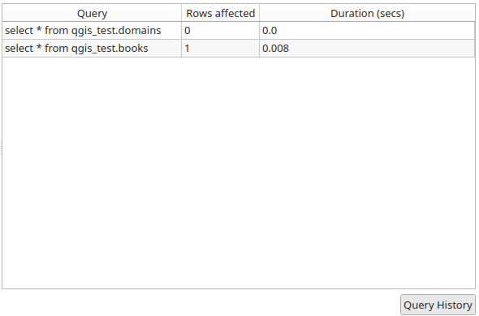
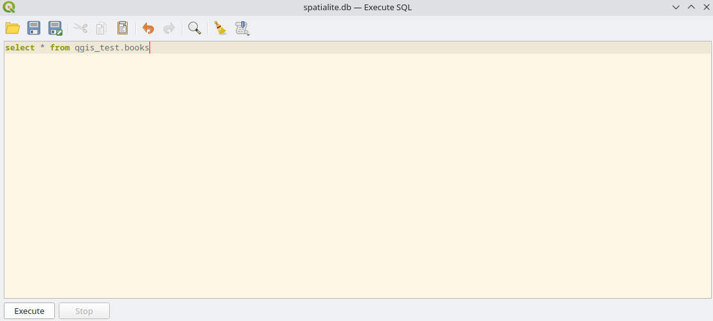
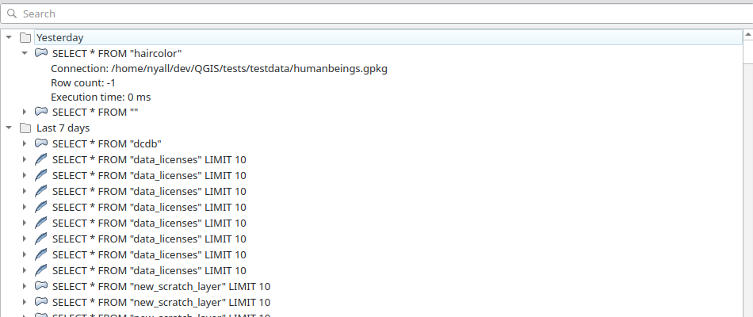

# QGIS Enhancement: Port SQL Query History to Browser

**Date** 2025-02-27

**Author** Nyall Dawson (@nyalldawson)

**Contact** nyall.dawson@gmail.com

**Version** QGIS 3.44-3.46

# Summary

As part of the long-term strategic plan to move the DB Manager plugin functionality into
the QGIS browser panel, this proposal covers porting the "history" component of the DB
Manager SQL dialog to the main QGIS browser.

The screenshot below shows the current DB Manager history panel:

_**This is the last feature available in DB Manager's SQL window which is not yet available
via the QGIS Browser panel.**_

## Proposed Solution

The existing "Execute SQL" dialog (``QgsQueryResultWidget``) will be modified to add support
for query history. The current state of this dialog is shown below:

Specifically, a new toggleable action will be added to the toolbar in this dialog which will
open a new query history panel. The dialog will be reworked to use a ``QgsPanelWidgetStack``
as the base widget, allowing the new query history panel to be opened inline as a stacked
``QgsPanelWidget``. (This avoids the need to open a new dialog to show the history, or
try to squash the widget into the already full ``QgsQueryResultWidget`` layout.)

Instead of the rudimentary table used in the DB Manager history panel, the existing ``QgsHistoryWidget``
widget will be reused for the query history. This widget is the same class as is used
by the Processing history dialog, and shows historic commands grouped nicely in chronological
groups. The widget supports full text search through previous logged queries, and also includes
the details of the associated connection, row count and execution time. See screenshot below.

For more details on the ``QgsHistoryWidget``, see https://github.com/qgis/QGIS-Enhancement-Proposals/issues/130.

(It's worth noting that a history provider for database queries has been in place since
April 2023 (see https://github.com/qgis/QGIS/pull/52867), so existing QGIS user profiles
have already an extensive log of query history which is not exposed ANYWHERE in the
GUI yet!)

Double-clicking any of the entries in the history will insert that query into the current
SQL query and immediately dismiss the history panel.

### Application Integration

The query history will also be exposed as a top-level action in QGIS, just like the
Processing history dialog is. An action will be added to the ``Database`` menu
for ``Query History...``, which will open the query history as a standalone window.

Double clicking-on any of the entries in the list will open an "Execute SQL" window
for the same connection as the original query was executed on, pre-populated with that
query.

### Provider Compatibility

The history panel will be accessible wherever ``QgsQueryResultWidget`` is used, which includes:

- The browser "Execute SQL" action
- The layer context menu "Execute SQL" action
- SQL view layer context menu "Update SQL" action

Accordingly, it will be compatible with all providers which support the Execute SQL action,
which are all existing vector database providers (Postgres, SQL Server, Oracle, HANA, GeoPackage,
Spatialite, ESRI File GeoDatabase...)

### Compatibility with DB Manager

The new query history will **not** be compatible with the DB Manager history. Entries from
the DB Manager history will not appear in the log, and queries executed through the browser
will not appear in the DB Manager history. 

## Deliverables

- Query history added to the browser SQL execution windows
- Query history available through the main window ``Database`` menu

### Affected Files

- QgsQueryResultWidget
- QgsHistoryWidget
