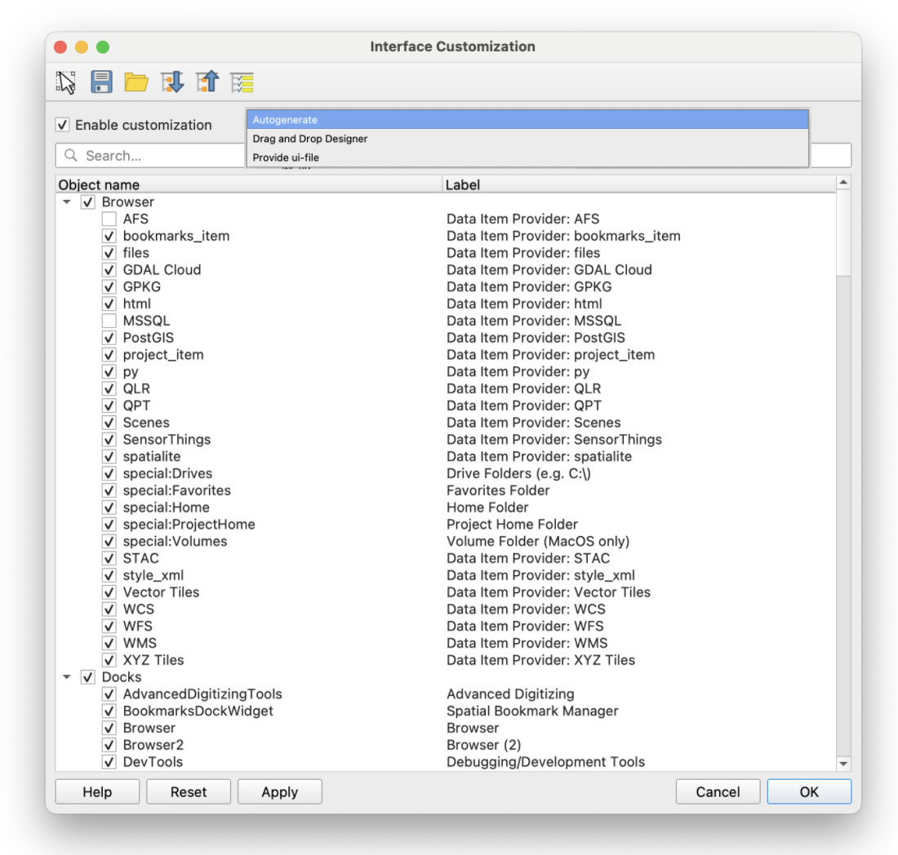
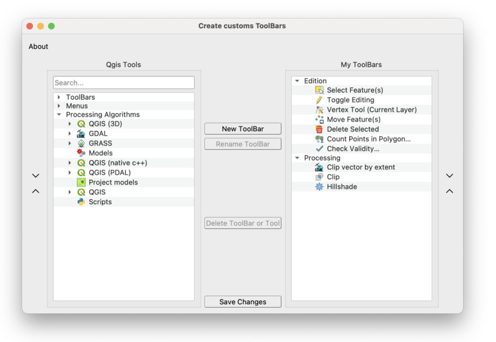
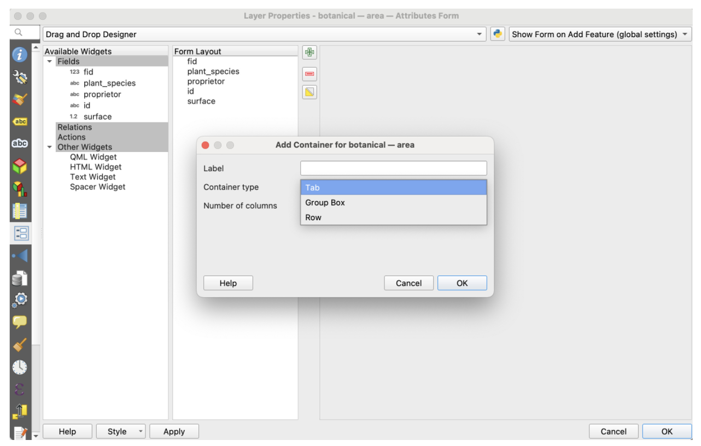
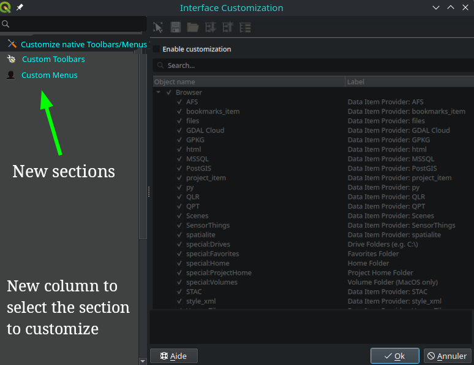

# QGIS Enhancement: Customized Toolbars and Menus

**Date** 2025/06/24

**Author** Jacky Volpes (@Djedouas)

**Contact** jacky dot volpes at oslandia dot com

**Version** QGIS 4.0

## Summary

The QGIS interface can be customized through the Settings > Options menu (e.g. to add processing algorithms to the toolbar) and through the Settings > Interface Customization dialog (deactivate/activate elements in menus, docks, toolbars, ...).

In addition to activating or deactivating action items within the predefined menus and toolbars, this proposal would allow for the creation of “new” toolbars and menus, composed of an individual selection of the available items in the Interface Customization dialog.

Custom toolbars can currently be created with the plugin [Customize ToolBars](https://plugins.qgis.org/plugins/CustomToolBar/). The plugin has good ratings and has been downloaded frequently, showing that there is an interest for this functionality. Limitations of this plugin are:

  * the storing of the settings in a binary file outside the QGIS folder structure
  * possible maintenance issues
  * loading of saved configurations is not possible through the plugin GUI (less intuitive for users)
  * it's a plugin

## Proposed Solution

The integration of customized toolbars within the Interface Customization dialog would be a logical follow-up to the already available GUI customization possibilities. The configuration would also be saved within the user profile QGIS > QGISCUSTOMIZATION3.ini file.

Additions to the Interface Customization dialog would be:

  * similarly to the attribute form settings, a drop-down that allows to use a "drag and drop designer" for the configuration of the different components of the GUI
  * if the "drag and drop designer" is chosen, the possibility (green plus icon) to add new "containers" (similarly to adding new containers in the attribute form settings), with the choice between "menu" and "toolbar"
  * a "provide .ini file" option to load an existing configuration
  * an "export configuration" button opening the profile folder at QGIS > QGISCUSTOMIZATION.ini

Possible integration of a drop-down menu similar to the layer attribute form dialog

Current interface of the Customize ToolBars plugin

Layer attribute form dialog (drag and drop designer; add container)

### Processing algorithms

Currently, processing algorithms can be added to the "Processing Algorithms Toolbar", through a non-intuitive and cumbersome user experience.

We propose to drop this logic, to integrate all processing algorithms in the new toolbars and menus customization.

### Affected Files

- src/app/qgscustomization.[cpp|h]

The new interface to customize toolbars and menus will be new sections in the Interface Customization dialog:

Example of new sections in the Interface Customization dialog.

### Delimitation

  * A restart of QGIS could be necessary to take into account the changes (as it is already the case for modifications in the Interface Customization dialog).
    - We will try to overcome this limitation, but if it is necessary then the user will be advertised
  * If plugin actions are added to custom toolbars/menus and the configuration is imported within a profile where those plugins are missing, the missing items will be ignored. There will be no tracking of dependencies from plugins and therefore no warnings if a certain action is missing.
  * Personal Python scripts will not be available.
  * Customization is limited to toolbars and menus, as we have not identified any need for further customization of the browser, docks, status bar or widgets so far.

## Risks

None known.

## Performance Implications

No change in performance to be expected.

## Further Considerations/Improvements

In a further step, any additional need for customization for browser, dock, status bar or widget elements could also be discussed.
