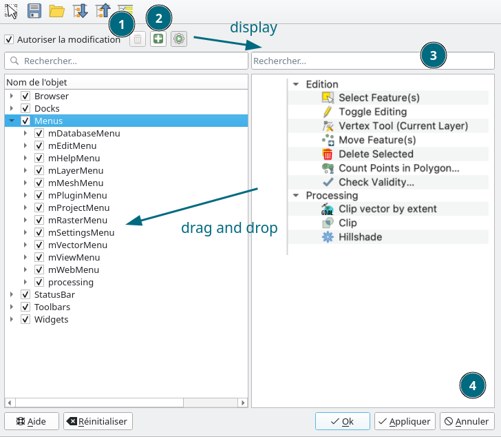

# QGIS Enhancement: Customized Toolbars and Menus

**Date** 2025/06/24

**Author** Julien Cabieces (@troopa81), Jacky Volpes (@Djedouas)

**Contact** julien dot cabieces at oslandia dot com, jacky dot volpes at oslandia dot com

**Version** QGIS 4.0

## Summary

The QGIS interface can be customized through the Settings > Options menu (e.g. to add processing algorithms to the toolbar) and through the Settings > Interface Customization dialog (deactivate/activate elements in menus, docks, toolbars, ...).

In addition to activating or deactivating action items within the predefined menus and toolbars, this proposal would allow for the creation of “new” toolbars and menus, composed of an individual selection of the available items in the Interface Customization dialog.

Custom toolbars can currently be created with the plugin [Customize ToolBars](https://plugins.qgis.org/plugins/CustomToolBar/). The plugin has good ratings and has been downloaded frequently, showing that there is an interest for this functionality. Limitations of this plugin are:

  * the storing of the settings in a binary file outside the QGIS folder structure
  * possible maintenance issues
  * loading of saved configurations is not possible through the plugin GUI (less intuitive for users)
  * it's a plugin

## Proposed Solution

### UI

New customization interface would approximatively look like this



- Delete button (1) woud allow to remove a previously user added toolbar or menu. The button would be greyed out if the currently selected item is not a user defined toolbar or menu.
- Add button (2) woud allow to add a new menu as a child of an already selected menu
- An icon would indicate if this a user defined toolbar or menu
- A button would make visible a panel to search (3) and browse through all existing actions and processings
- It would then be possible to drag and drop those actions directly in the actual customization tree widget onto user defined menu or toolbar
- It would be possible to reorder actions inside the customization tree on user defined menu and toolbars using drag and drop
- On first customization dialog opening, customization tree root items (Docks, Toolbars, Menus...) would be folded to allow a first concise view
- It would be possible to edit icons for processing item only

### Dropping ini file for XML

The QGIS customization is stored in a profile ini file. I propose to drop the ini file format for an XML one because:
- We actually describe a tree hierarchy in the file and ini format is more a flat key/value pair format
- ini file is an unordered format and we need order to correctly describe the button order in user defined toolbar/menu
- That would be a solid ground basis for more customization possibilities (like [workspaces](https://github.com/qgis/QGIS-Enhancement-Proposals/issues/302) for instance).

The new XML file definition would look like this

```xml 
<Customization splashPath="mySplashScreen.png" >

  <Browser>
    <BrowerItem name="SensorThings" visible="true" />
    <BrowerItem name="GPKG" visible="false" />
    <BrowerItem name="PostGIS" visible="true" />
	<!-- ... -->
  </Browser>
  <Docks>
	<Dock name="AdvancedDigitizingTools" visible="true" />
	<Dock name="BookmarksDockWidget" visible="false" />
	<Dock name="Browser" visible="true" />
	<Dock name="DevTools" visible="true" />
	<!-- ... -->
  </Docks>
  <Menus>
	<Menu name="mEditMenu" visible="true" />
	  <Action name="mActionCopyFeatures" visible="true" />
	  <Action name="mActionCutFeatures" visible="true" />
	  <Action name="mActionDeleteSelected" visible="true" />
	  <Action name="mActionOffsetPointSymbol" visible="true" />
	  <Menu name="mMenuEditGeometry" visible="true" >
	    <Action name="mActionAddPart" visible="true" />
	    <Action name="mActionAddRing" visible="true" />
	    <Action name="mActionDeletePart" visible="true" />
	    <Action name="mActionDeleteRing" visible="true" />
	    <!-- ... -->
	  </Menu>
	  <UserMenu name="mySuperMenu" label="My Super Menu" visible="true">
	    <ActionRef path="Menus/mEditMenu/mMenuEditGeometry/mActionDeletePart" />
		<ActionRef path="ToolBars/mAdvancedDigitizeToolBar/ActionPointSymbolTools" />
	  </UserMenu>
    </Menu>
	<!-- ... -->
  </Menus>
  <StatusBar>
	<Widget name="LocatorWidget" visible="true" />
	<Widget name="mCoordsEdit" visible="true" />
	<Widget name="mMagnifierWidget" visible="false" />
	<Widget name="mMessageLogViewerButton" visible="true" />
  </StatusBar>
  <ToolBars>
    <ToolBar name="mAdvancedDigitizeToolBar" visible="true">
	  <Action name="ActionMoveFeatureTool" visible="true" />
	  <Action name="ActionPointSymbolTools" visible="true" />
	  <Action name="mActionMergeFeatureAttributes" visible="false" />
	  <!-- ... -->
	</ToolBar>
    <UserToolBar name="mySuperToolbar" visible="true">
      <ActionRef path="Menus/mEditMenu/mMenuEditGeometry/mActionDeletePart" />
      <ActionRef path="ToolBars/mAdvancedDigitizeToolBar/ActionPointSymbolTools" />
	  <Processing id="native:buffer" icon="mysupericon.png" />
	  <Processing id="native:joinattributesbylocation" icon="myothersupericon.png" />
    </UserToolBar>
  </ToolBars>
  
</Customization>
```

We would keep the QGIS global settings `UI/Customization/enabled` to know if the XML file has to be loaded to customize the application or not.

We would distinguish system and user menu/toolbar XML tag. The former is already shipped in QGIS and can only be made visible or not while the latter would reference already existing action.

Defining menu and toolbar order would only be possible for user menu/toolbar.

The XML file would be written when selecting the **apply** button from the customization dialog.

#### Retro compatibility

In order to keep backward compatibility, a function would load the actual ini file into the new inner structure so it would be then written in XML.

QGIS would also read the `Processing\Configuration\(BUTTON_XXX/ICON_xxx/MENU_xxxx)` old settings from global QGIS configuration and would convert it to the new structure. Those settings would then been removed. 

#### Dropping the "Widgets" part

This part of the current customization code is supposedly targeted to allow to change the visibility of ANY widget within the application. It relies on the [customization.xml](https://github.com/qgis/QGIS/blob/master/resources/customization.xml) file which lists all application widgets and their name. This file can be easily out of sync as soon as a contribution would add, remove or change name of widgets. It hasn't been updated for 7 years and the script `widgets_tree.py` allowing to generate this file as been removed in [#60366](https://github.com/qgis/QGIS/pull/60366/).

I propose to COMPLETELY remove this feature.

This is a BREAKING CHANGE but my assumption is that nobody is actually using it regarding the fact that the `customization.xml` file is at least 7 years out of date (certainly more for some widgets). I tried to use it on several widgets and failed every time.

The very much concept of configuring every part of the UI is IMHO a bad idea:
- It's fragile because UI is regularly modified
- It could break the UI consistency (a hidden button could, at some point, block the workflow)
- A hidden button could then be made visible by code upon a given event

I think the good way to answer this feature request (if there is any) is to exposed named and documented settings for every part of the UI we judge necessary to do so, and deal with it in the code.

### Error reporting

We plan to report error for both system and user defined menu or toolbar that would be missing when loading the customization file.

Errors would be reported directly to the user so he could then fix them accordingly.

### Implementation

Contrary to what is actually being done in `QgsCustomization` when checking/unchecking actions and menus item from tree widget, we would not remove the associated actions/menus/toolbars from the menus and toolbars, but simply make them visible or not. Thus, it would be possible to update the interface easily when clicking on apply, and make visible a previously hidden action/menu/toolbar.

We propose also to revamp the code in order to have a clear separation between `QgsCustomization`, reading/writing the XML file and providing method to apply the customization to the application interface, and `QgsCustomizationDialog` allowing to display and edit this configuration.

### Processing algorithms

Currently, processing algorithms can be added to the "Processing Algorithms Toolbar", through a non-intuitive and cumbersome user experience.

We propose to have the possibility of integrating any processing algorithm into the new customization interface of toolbars and menus.

We would get rid of the actual `Menus` item in *Settings > Options > Processing*.

### Icons

It would be possible to set icon on processing item only, menu and toolbar have already their defined icon and we don't intend to change that in this proposal.

### Plugins

The new system would work the same way with plugin than with any other system menu/toolbar/action. When a plugin is loaded, we do not intend to reload automatically the customization. 

### Affected Files

- src/app/qgscustomization.[cpp|h]

### Delimitation

Personal Python scripts will not be available.

## Risks

None known.

## Performance Implications

No change in performance to be expected.

## Further Considerations/Improvements

In a further step, any additional need for customization for browser, dock, status bar or widget elements could also be discussed.
