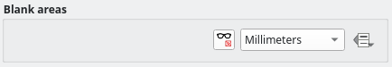

# QGIS Enhancement: Markers/Hashes line symbol layer blank areas 

**Date** 2025/07/22

**Author** Julien Cabieces (@troopa81)

**Contact** julien dot cabieces at oslandia dot com

**Version** QGIS 4.0

# Summary

This proposal relates to the line symbol layer which draw markers or hashes at intervals along a line. When using such symbol layer, the display of the repeated pattern (hash or marker) can be ugly, and user would like to have a better control on what's displayed.

The rest of the proposal will mention markers but everything describe here applies also to hashes.

## Proposed Solution

In order to have a proper display of the markers along the line, I propose to:
- Give user a way to identify blank area where markers are not displayed
- Use the already existing annotation feature to add, move, rotate or even change marker symbology

This could look like approximatively this

### The blank areas

These areas would be defined as start and end distances from the first point of the line or polygon. It would be possible to define the unit of those distances.

A new Property would be added to the QgsSymbolLayer [enum](https://github.com/qgis/QGIS/blob/d01be3798eb05c74a61629042f7189ad9c594b1e/src/core/symbology/qgssymbollayer.h#L147) and it would be possible to explicity set a data defined property for all `QgsTemplatedLineSymbolLayerBase` symbol layers (which marker line and hash line symbol layer inherits from). It would be possible then to define those blank areas either:
- in a static way, 
- with a specific data field,
- an auxiliary data storage field,
- an expression.

When used with a field, this information would then be stored per feature, per layer, per symbol layer.

A new widget to edit those blank areas would be inserted within marker line symbol layer widget.

#### QgsMapToolDefineBlankArea

A new map tool `QgsMapToolDefineBlankArea` will allow to define these blank areas. 

The new map tool will be accessible through the symbology editor ( in the screenshot above, even though a new icon will be proposed), and only here (because you need to choose the symbol layer you are going to add the blank areas).

Button to activate this map tool would be disable if the symbology editor is not docked, because:
- The properties window is modal and need to be closed before starting to add blank lines
- User need some direct visual feedback when defining those blank areas

A tooltip will explain why when it's disabled.

This tool will allow to:
- Click in the neighborhood of the line to start creating an area, click again to finish editing the zone like on the video above.
- Select an area, press `Del` key to remove it
- Drag the start/end of an already existing area and move it along the line to reduce/enlarge it
- Drag the zone entirely and move it along the line

the map tool defined zone would be set on `QgsTemplatedLineSymbolLayerBase` symbol layers as data defined properties. If no data defined property has been set, a window would ask user if he wants to generate an auxiliary storage layer and which field he wants to use to join.

`QgsMapToolDefineBlankArea` will define its own rubber band class `QgsMapToolBlankAreaRubberBand` to edit the areas. It would retrieve symbol layer offset, and layer geometries within the view extent and will use the  [offsetLine](https://github.com/qgis/QGIS/blob/d01be3798eb05c74a61629042f7189ad9c594b1e/src/core/symbology/qgssymbollayerutils.h#L1175) method to properly compute the rubber band areas to be drawn (in a way like the one in the above video).

#### Modified geometry

As the blank areas are defined as distances from the starting point of the geometry, it's to be noted that geometry modifications may change the absolute position of the blank areas and the rendering may differ from the original definition.

This is considered acceptable because this feature mainly targets layer that would be subject to few geometry modifications. 

#### Rendering impact

Rendering impact would be light. Distances would be sorted and treated accordingly to detect whether or not we need to [render](https://github.com/qgis/QGIS/blob/5b59269f98799597df125744823a0163d3061548/src/core/symbology/qgslinesymbollayer.cpp#L1872) the marker or not

### Affected Files

- qgslinesymbollayer.cpp
- qgsmaptooldefineblankarea.h
- qgsmaptooldefineblankarea.cpp

## Risks

None identified at this stage.

## Performance Implications

As already pointed out, performance could be impacted as soon as fixed mode is enabled but it should remain acceptable and no actual impact would appear on existing project.

## Further Considerations/Improvements

None

## Backwards Compatibility

Full backward compatibility

## Issue Tracking ID(s)

None
