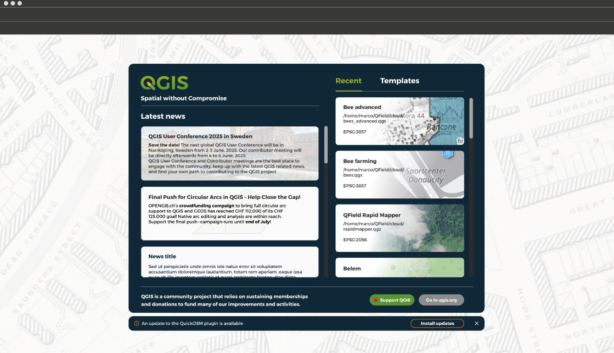

# QGIS Enhancement: Welcome Page Revamp

**Date** 2025/11/11

**Author** Mathieu Pellerin (@nirvn)

**Contact** mathieu@opengis.ch

**Version** QGIS 4.0.0+

## Summary

The current welcome page users land on when opening QGIS has a few
shortcomings. Here’s a non-exhaustive list of issues:

- The templates section – rarely used - takes too much space when
weighted against other components, especially the news section.
- The overall look lacks ties to the QGIS branding and feels outdated.
- The layout lacks outbound links to QGIS.org and other useful links
such as the visual release changelog.

Crucially, the current welcome page does not facilitate directing able and willing
users into supporting the QGIS project. Considering the crucial role
donations play in the continuity of QGIS, this feels like a significant
gap worthy of addressing.

## Proposed Solution

This QEP proposes to re-do the welcome page, and to do so in Qt’s Quick
framework to gain the ability to increase the visual appeal for this
crucial landing page with new and seasoned users. Embracing the Qt Quick
framework will allow us to build a modern welcome page based on a
dynamic GUI with fluid animations and responsive graphics.

Adopting Qt Quick allows us to build much of the welcome page using the
QML declarative language. In turn, this makes it easier for the welcome
page to adopt a style that will more closely resemble the QGIS branding
seen on the QGIS.org website. 

### Features and Benefits

The revamp will implement a layout mock-up approved by the PSC, which
will resemble the image below:

The new layout puts **more emphasis on the news section**, which is a
crucial tool through which the QGIS project can keep its users informed
of user conferences  and significant crowdfunding efforts as well as
other important information enabling the broader community to interact
with and support QGIS’ continued development.

In addition, a call for support will act as a **gentle visual reminder
to users of the importance of community donation** while **lowering the
bar for those able and willing to support QGIS’ continued development**
by offering a direct on-click link to QGIS.org’s donation page.

The welcome page will also offer useful outbound links such as the visual
release changelog that will open in users' external browser.

### API Considerations / Affected Files

The work here will not add any new core or GUI classes. A new
QQuickWidget-based QgsWelcomePage class will supersede the current class
living in src/app.

Preexisting classes will be leveraged in the implementation of this new
welcome page, including:

- QgsNewsFeedModel and QgsNewsFeedParser for the latest news section;
- QgsTemplateProjectsModel for templates; and 
- QgsRecentProjectsItemsModel for recent projects.

These classes might be tweaked with new functionalities to support the
implementation of the finalized layout mock-up.

The new QgsWelcomePage will be added as a widget overlay of the main
window's central widget area where the QgsMapCanvas lives.

## Deliverables

A new functional welcome page that matches the PSC-approved finalized
layout mockup.
