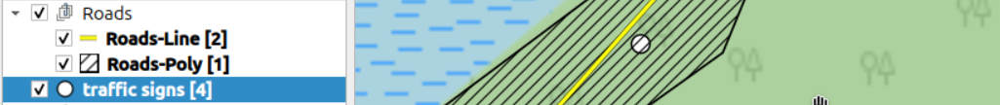
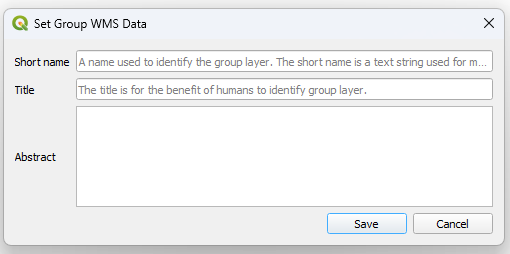

# QGIS Enhancement: Opaque Layergroups in QGIS-Server

**Date** 2025/08/28

**Author** Oliver Jeker (@ojeker) / Dave Signer (@signedav)

**Contact** oliver dot jeker at bd dot so dot ch / david at opengis dot ch

**Version** QGIS 4.0 or 4.2

# Summary

We would like to extend QGIS with the capability to serve **opaque layergroups** through OGC WMS. Opaque layergroups hide all their children, grandchildren, ... (named **opaque childlayers** in this QEP) in the layertree. In GeoServer it's called an [opaque container](https://docs.geoserver.org/main/en/user/data/webadmin/layergroups.html#layer-group-modes), while in QGIS we would use "opaque" as the descriptive word as well and keep layer groups to follow QGIS-style wording.

Our motivation is to hide implementation details from the user. One usage example for an opaque layergroup is a detailed road_polygon dataset and an overview road_line dataset. The point and polygon layer of these two datasets are contained in the opaque layergroup "Roads".



## Intended behaviour

Most behaviour of an opaque layergroup is the same as in the "normal" already existing layergroup. This chapter explains the differences in behaviour between opaque and normal layergroups for all WMS operations.

### Differing behaviour for

* **GetCapabilities**   
Opaque layergroups hide all their **opaque childlayers** in the GetCapabilities response. Only the opaque layergroup itself is returned and looks like a "singlesource" layer (QgsVectorLayer, QgsRasterLayer) in the layer tree.

    ```xml
    <Layer queryable="1">
    <Name>Roads</Name>
    <Abstract>This is an opaque layergroup</Abstract>
    <CRS>CRS:84</CRS>
    <CRS>EPSG:4326</CRS>
    <CRS>EPSG:3857</CRS>
    <EX_GeographicBoundingBox>[...]</EX_GeographicBoundingBox>
    <BoundingBox CRS="EPSG:3857" maxx="930992.313" maxy="5947431" minx="930871" miny="5947339"/>
    <BoundingBox CRS="EPSG:4326" maxx="47.03281" maxy="8.363247" minx="47.032245" miny="8.362156"/>
    <Style>[...]</Style>
    </Layer>
    ```

    Without any `<Layer>` elements in this object.

* **GetContext**    
Opaque childlayers are not listed.

* **GetProjectSettings**    
Expose the new property in the group setting information.
    ```xml
    <Layer expanded="1" mutuallyExclusive="0" queryable="1" visibilityChecked="1" visible="1">
        <Name>Roads</Name>
        [...]
        <IsOpaque>1</IsOpaque>
        [...]
    ```

* **Requests on children (like GetMap, GetFeatureInfo, GetStyle(s), GetLegendGraphic(s), DescribeLayer)**    
Requests containing a **opaque childlayers** in the "layers" parameter get the same error response as when requesting a layer that does not exist in the layer tree.
    ```xml
    <ServiceExceptionReport xmlns="http://www.opengis.net/ogc" version="1.3.0">
        <ServiceException code="LayerNotDefined">The layer 'RoadsInOpaqueGroup' does not exist.</ServiceException>
    </ServiceExceptionReport>
    ```
    What is `OGC_LayerNotDefined` in source code.

#### Is "Layer does not exist" always the preferred feedback?

There is a different behavior on requesting a non-existent layer or an excluded layer.

  Request           | Non-Existent         | Excluded            |
 |---------------------|----------------------|---------------------|
 | GetMap              | OGC_LayerNotDefined  | Not displayed (white canvas)       |
 | GetFeatureInfo      | OGC_LayerNotDefined  | OGC_LayerNotDefined |
 | GetStyle / GetStyles| OGC_LayerNotDefined  | Empty reply      |
 | GetLegendGraphic    | OGC_LayerNotDefined  | OGC_LayerNotDefined | 

We propose to handele the **opaque childlayers** same like the non-existent layer and return `OGC_LayerNotDefined`.

### Same behaviour for

Normal layergroups and **opaque layergroups** on:

* **GetMap** request on the opaque layergroup   
Requests containing **opaque layergroups** in the "layers" parameter are rendered the same way as normal layergroups. 
* **GetFeatureInfo**
* **GetLegendGraphic**
* etc.

## Proposed Solution

Add a checkbox or dropdown to the form "Set Group WMS Data" to choose if the group is opaque or not.



(As well we propose to change the dialog title to "Set Group WMS Properties")

A new member `isOpaque` will be added to the `QgsMapLayerServerProperties` of `QgsLayerTreeGroup` store this configuration.

In the server classes it can be handled similar to the `wmsRestrictedLayers` (the excluded layers), but with the difference, that they are not hidden on everything (e.g. rendered on GetMap requests of the group).

On `QgsWmsRenderContext::initOpaqueGroupLayers()` it checks the `isOpaque` on the groups' server properties and fills up the `QStringList mOpaqueChildLayers`. They should not be considered in `removeUnwantedLayers`, because it still should be rendered. 

On a request on one of the **opaque childlayers** it should check `QgsWmsParameter::LAYER` against `mOpaqueChildLayers` and throw the `OGC_LayerNotDefined` error "The layer '%1' does not exist."

On `GetCapabilties` it should return in functions like `appendLayersFromTreeGroup` and be detected for removing in `appendDrawingOrder` etc.

### Preferred behavior on duplicate layer names / short name in the layer tree

QGIS Server currently [merges layers with identical names (or short names)](https://github.com/qgis/QGIS/pull/33952). The opaque layergroup proposed in this QEP allows for more control over grouping and thus will have higher priority. If doable *without adding too much complexity*, our targetted behavior will be:

* When requesting the layer name (or short name), only the layer in the non-opaque part of the layer tree must be rendered.
* When requesting the opaque layergroup, only the child of the opaque layergroup must be rendered, and not merged with another same named layer outside the opaque layergroup. But when requesting a opaque layergroup having the same name as another layer outside an opaque layergroup, the opaque layergroup should be merged with the same named layer.

But e.g. when having a opaque group "roads":
``` 
- roads
  |- roadline
  |- roadpoly
- roadline
``` 

When requesting "roads" only the first roadline is rendered. And when requesting roadline only the second roadline is rendered.

A layername will not be added to the `mOpaqueGroupLayers`, when there is a identical named layer outside an opaque layergroup. On requesting the layer outside the opaque layergroup it should care in `QgsWmsRenderContext::searchLayersToRender()` that it should not be "merged" with the identical named layer inside an opaque layergroup.