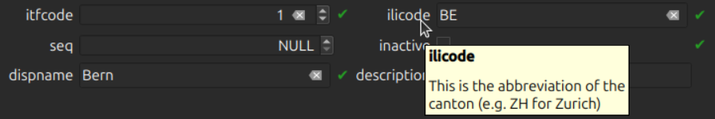
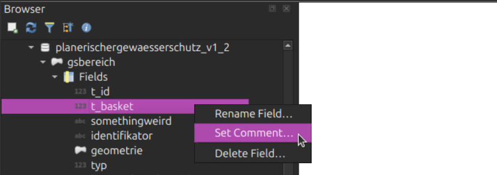
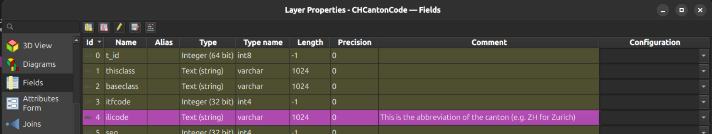
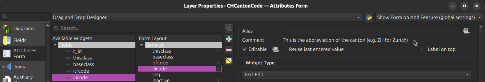
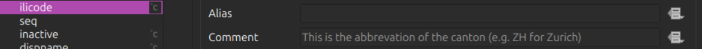
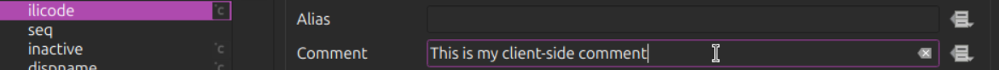
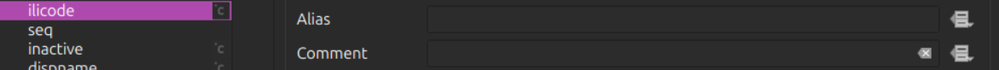
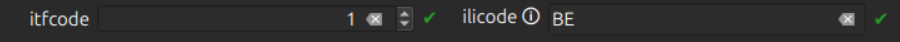

# QGIS Enhancement: Title

**Date** 2025/11/24

**Author** Dave Signer (@signedav)

**Contact** david at opengis dot ch

**Version** QGIS 4.0 or 4.2

# Summary

This QEP introduces the possibility to change field comments on the client side, which are stored in the QGIS configuration. The solution does **not propose** to introduce more possibilities to change the server-side comments. It's about **client-side comments** that override the server-side comments in QGIS.

The need for this is because server-side comments have their limitations:
- No user rights to change them
- When you change them, they are changed for everyone connecting to the database (you could potentially break other QGIS project workflows).

That's why client-side comments should be introduced.

## The existing server-side comments

More context regarding the server-side comments.

### Where are they defined?

Column comments are defined directly in the database. They are mainly used in `PostgreSQL`, for example:

```
COMMENT ON COLUMN plan.chcantoncode.ilicode IS 'This is the abbreviation of the canton (e.g. ZH for Zurich)';
```

Another provider that utilizes them is the `GrassLayers`.

They are read on `loadFields` within the provider and are then stored in the `QgsField` objects.

### Where are they used in QGIS?

The comments are displayed as hover tooltips in the forms.



### Where can these comments be changed?

In the browser panel you can *edit* / *add* such comments to columns.



Also in the layer properties "Fields" section you can *add* a comment on adding a *new* column. However, you *cannot edit* existing ones.



You can *view* these comments in the layer properties "Attribute Form" section, but you *cannot edit* them.



## Proposed Solution

Introduce **client-side comments** stored in the QGIS configuration (like the aliases), which will override the server-side comments. This means if a client-side comment exists, it will be used. Otherwise, the server-side comment will be used.

### Comment definition

In the `QgsAttributeTypeDialog` the comment is editable (`QLineEdit`). It offers the same options as the alias, including the possibility of being data-defined by expressions, utilizing a `QgsPropertyOverrideButton`.



When we edit the comment in the attribute form settings, a client-side comment is defined and will be taken into account.



If no client-side comment is defined (it's `NULL`- removed again using the x-arrow on the right), the server-side comment is taken into account again.

When a client-side comment contains an empty string (`""`), the client-side comment is taken into account, and **not** the server-side comment. This means using an empty string will prevent any comment from being displayed at all.



We decided on this approach and against the alternative of using a "Disable comment" checkbox, which would disable widget in the settings and prevent the display of both client- and server-side comments in the QGIS form.

### Storage

The client-side comments are stored in the project configuration, similar to the aliases.

```xml
<maplayer [...]>
    <id>CHCantonCode_9b624185_fd48_48ab_aa93_7f66ed96acca</id>
    [...]
    <aliases>
        [...]
        <alias index="4" field="ilicode" name="Canton Code"/>
    [...]
    <comments>
        <commment index="4" field="ilicode" description="This is the abbreviation of the canton (e.g. ZH for Zurich)">
```

They are in written to `QgsField::mComment` on `QgsAttributesFormProperties::apply` overwriting the server-side comment that was originally set by the provider.

### Visual improvements

Currently, the comment is shown in the attribute form as a tooltip for the field name or alias (the tooltip on the editor widgets is handled individually by the editor widget itself).

However, since no one reads a tooltip when they do not know that there is one and the attribute form is often used by inexperienced users, this QEP also proposes an icon 🛈 (parameterized SVG) in the form. This icon visually informs the user that the field contains additional information. The tooltip will appear when the icon is clicked.



If an empty string is defined as the client-side comment, the icon is not displayed.

### The server-side comments

The existing options to edit or add a server-side comment will remain entirely unchanged. Only visual improvement is the icon mentioned above.

## Deliverables

- `QgsAttributeTypeDialog` is enhanced with the edit option for client-side comment and the additonal widgets
- New method `QgsVectorLayer::setFieldComments` to set the client-side comment overrides to `QgsField::mComment` on `QgsAttributesFormProperties::apply`
- `readSymbology` and `writeSymbology` in `QgsVectorLayer` to read / store client-side comments in the project file.
- Icon 🛈 is enabled in the `QgsAttributeFormEditorWidget` according to the comment.

### Affected Files

- qgsattributetypedialog.cpp
- qgsattributetypeedit.ui
- qgsattributesformproperties.cpp
- qgsvectorlayer.cpp
- qgsattributeformeditorwidget.cpp

## Risks

None