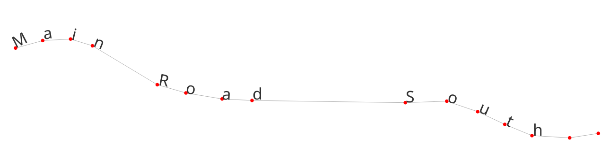
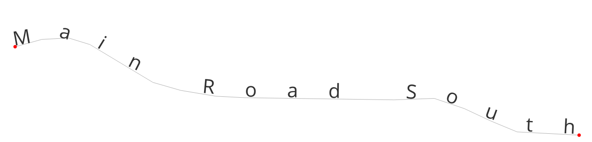
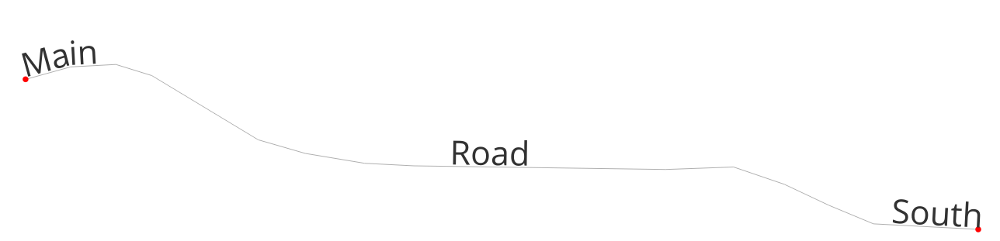

# QGIS Enhancement: Placement modes for curved label placement

**Date** 2025-11-18

**Author** Nyall Dawson (@nyalldawson)

**Contact** nyall dot dawson at gmail dot com

**Version** QGIS 4.0

# Summary

Current QGIS versions offer a "curved" label placement mode for placing label text with regular spacing
along a line/curve geometry.

There are current limited options for controlling how the characters are placed for a curved label. Choices
are limited to a fixed value for the character spacing and for word spacing.

This QEP introduces additional placement "modes" for use with curved labels, allowing for much more
fine-grained control over how text is positioned for curved labels.

## New modes

These additional modes will be exposed as options which are visible and enabled whenever a **line** geometry
type layer is set to curved label placement. (Note that while curved labeling is available also for polygon
perimeters, the new modes only make sense for line geometry types and consequentially will not be exposed
when a polygon layer is active).

A data defined override will be available for the new curved placement modes, allowing mixed use of different
modes for features within a single layer.

The modes to be introduced are:

### Default

Existing behavior, no change. Glyphs will be placed at regular character and word spacing along the curved line
geometry.

### Place characters at vertices

When this mode is selected, each individual character from the label text will be placed such that their
left-baseline position is located at a corresponding vertex from the curved line geometry. I.e. the
first character will be placed at the start of the line, the second at the second vertex, the third at the third
vertex, etc.

If the curved line geometry does not contain sufficient vertices for the characters present in the label text
then the excess characters will be ignored and will not be rendered.

If the label’s “distance” setting is non-zero, then the character will be vertically offset from the vertex
position by this distance.

Characters will be rotated to follow the line angle at the vertex.

### Stretch character spacing to fit line

When selected, this mode will increase (or decrease) the **character** spacing used for each label in order to fit
the entire text over the actual length of the curved line geometry.

### Stretch word spacing to fit line

When selected, this mode will increase (or decrease) the **word** spacing used for each label in order to fit the entire
text over the actual length of the curved line geometry. 

## API Changes

The new placement modes will be introduced as a enum, `Qgis::CurvedLabelMode`. The enum will be exposed via the
existing `QgsLabelLineSettings` class.

It will default to the `Default` value, ensuring that the placement for existing projects will remain unchanged.

Internally, the pal `FeaturePart::createCurvedCandidatesAlongLine` function will be modified to respect the curved
label mode when generating the placement of characters for a particular feature.

## Risks

None

## Performance Implications

None, this is a new setting and the default behavior will remain unchanged.

## Backwards Compatibility

N/A - the new modes will only be available in QGIS 4.0+.
