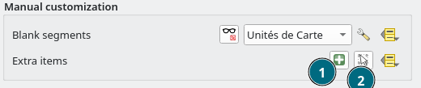
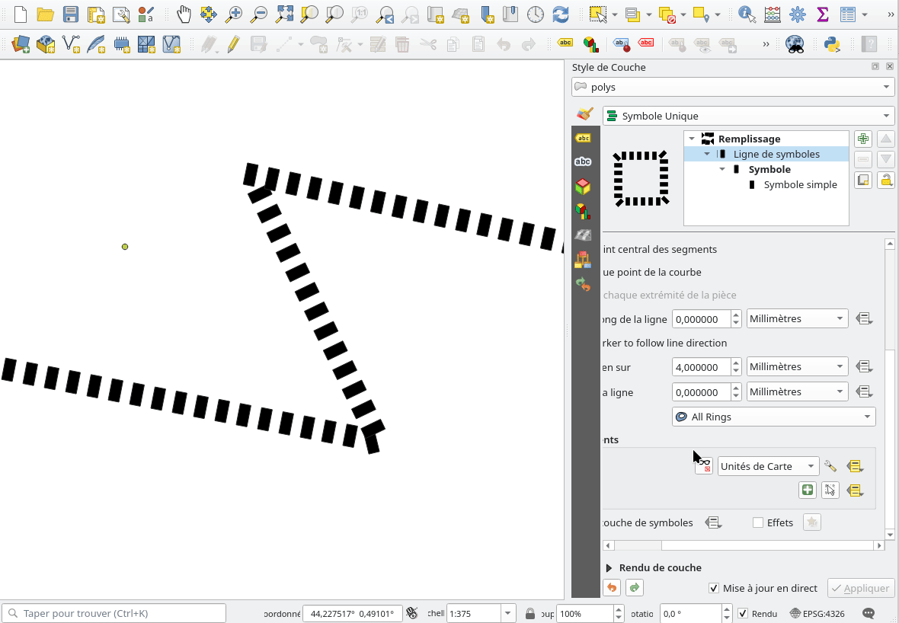

# QGIS Enhancement: Markers/Hashes line symbol layer extra items

**Date** 2025/12/01

**Author** Julien Cabieces (@troopa81)

**Contact** julien at cabieces at oslandia dot com

**Version** QGIS 4.0

# Summary

This is a follow up of [QEP #345](./qep-345-line-symbollayer-blankareas.md) which provides tool to define per feature blank segments on marker/hashed line symbol layer where no markers/hashes are displayed. You can see [here](https://github.com/qgis/QGIS/pull/64047#issue-3659188974) to learn more about how the feature is actually working.

The rest of the proposal will mention markers but everything describe here applies also to hashes.

This QEP aims at providing tools to create, move, rotate and delete new markers for these lines. Those new markers will share the same style as the original markers, the same selected or visibly state. 

## Proposed Solution

The new markers information will be stored per feature, per layer, per symbol layer.

A new Property would be added to the QgsSymbolLayer enum and it would be possible to explicity set a data defined property for all QgsTemplatedLineSymbolLayerBase symbol layers (which marker line and hash line symbol layer inherits from). It would be possible then to define those new markers either:

- with a specific data field
- an auxiliary data storage field

This property will be a string of comma separated tuple `(x, y, angle)` where `x` and `y` stands for the marker position in map unit (in the layer CRS)  and `angle` the marker rotation angle in radians.

### UI

A group box `Manual Customization` will integrate both this feature and the blank segments feature.

- User could select a map tool to add item (1)
  Left click would generate a new marker at the given position.
- User could select a map tool to select already created item to move/delete/rotate them (2)
  This map tool would follow the principles described [here](https://github.com/qgis/QGIS-Enhancement-Proposals/blob/bbfc1046ff63394e423f2b3b960a99d6734b08b8/qep-344-copy-move-rotate-annotation-layers.md#2-selectmove-annotations) except for the resize part.
  Pressing the `Del` button would delete selected markers.

### Map tools

2 new map tool will be added `QgsAddExtraItemMapTool` and `QgsModifyExtraItemMapTool`.

They will be accessible through the symbology editor, and only here (because you need to choose the symbol layer you are going to add/modify the new markers).

Button to activate this map tool would be disable if the symbology editor is not docked, because:
- The properties window is modal and need to be closed before starting to add new markers
- User need some direct visual feedback when defining new markers

A tooltip will explain why when it's disabled.

New markers will be set on QgsTemplatedLineSymbolLayerBase symbol layers as data defined properties. If no data defined property has been set, a window would ask user if he wants to generate an auxiliary storage layer and which field he wants to use to join.

### Rendering

`QgsTemplatedLineSymbolLayerBase` class (which marker line and hash line symbol layer inherits from) will iterate over those new markers and will render them calling the `renderSymbol` method after the original line rendering have been done.

## Deliverables

In addition to the blank segments feature, the implementation will deliver a way to manually customize marker or hashed line symbol layer for which the display of the repeated pattern (hash or marker) can be ugly.

User will then have a better control on what's displayed.

### Example(s)

The overall workflow will look approximatively like this

### Affected files

- src/core/symbology/qgssymbollayer(.h|.cpp)
- src/core/symbology/qgslinesymbollayer(.h|.cpp)
- src/gui/symbology/qgssymbollayerwidget(.h|.cpp)

## Risks

None identified

## Performance Implications

An extra time will be required to render the extra markers/hashes, but that's negligible.

## Further Considerations/Improvements

None

## Backwards Compatibility

N/A

## Issue Tracking ID(s)

N/A
