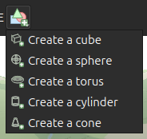
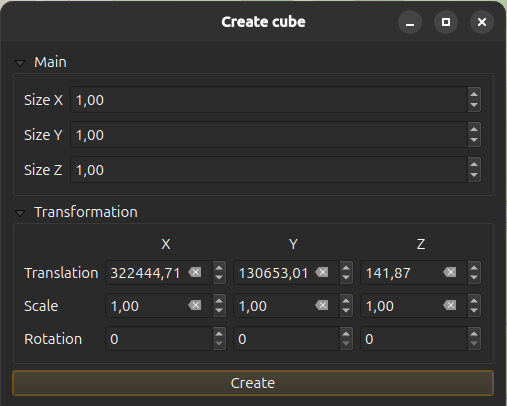
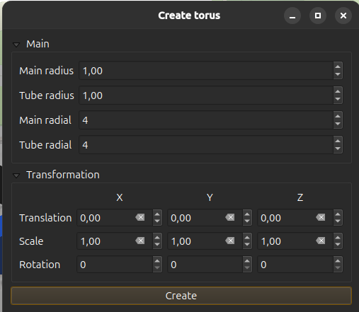
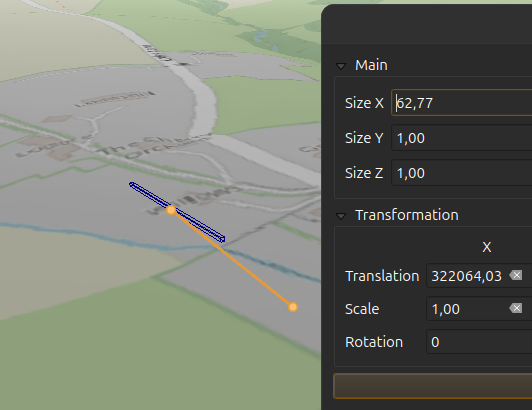
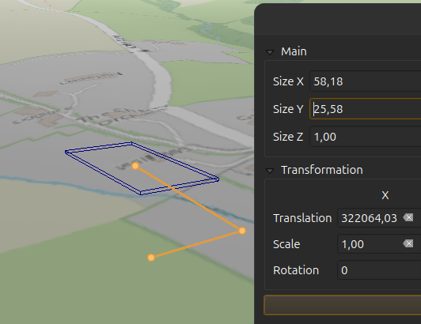
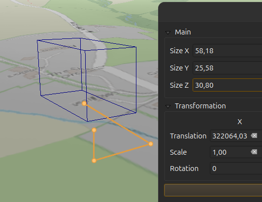
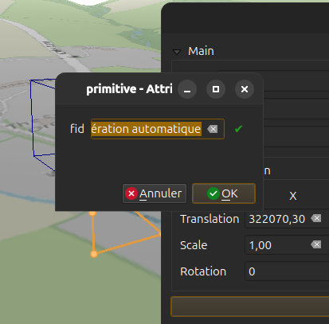

# QGIS Enhancement: Add 3D edition support

**Date** 2026/03/10

**Author** Benoit De Mezzo ([@benoitdm-oslandia](https://github.com/benoitdm-oslandia)), Jean Felder ([@ptitjano](https://github.com/ptitjano)), Loïc Bartoletti ([@lbartoletti](https://github.com/ptitjano))

**Contact** benoit dot de dot mezzo at oslandia dot com, jean dot felder at oslandia dot com, loic dot bartoletti at oslandia dot com

**Version** QGIS 4.2

## Summary

This QEP proposes introducing vector layer editing directly within the 3D view by adding dedicated 3D user interface tools. It will allow users to create primitive objects (such as boxes, spheres, and tori) and to apply 3D operations (including boolean operations and duplication) to existing 3D objects.

## 3D edition map tools

These new map tools will be developed within the 3D canvas beside 3D pointcloud attribute edition map tool. Four groups have been identified:

* 3D primitive creation
* 3D boolean operations (intersection, difference, union)
* 3D arrangement operations (copy, move, rotate, scale, mirror)
* 3D modeling operations (split, extrude, etc.)

## Proposed Solution

All these map tools will be available according to the type of the active layer, for example:

* it is not possible to add a 3D primitive like a torus on a RasterLayer or a PointCloudLayer
* the user will need a VectorLayer with PolyhedralSurface geometry to create 3D primitives
* the user will be able to copy/move/rotate any VectorLayer

Therefore when the active layer changes these map tools will be enabled/disabled according to their ability.

The new map tools will be grouped in 4 new toolbars to increase the modularity the `Qgs3DMapCanvasWidget` class. These toolbars will keep their map tools outside the `Qgs3DMapCanvasWidget` class which in return will handle a bunch of edition toolbars. To do so a new abstract class `Qgs3DEditionToolBar` will be added to help in the creation of these edition toolbars.

Currently, the point cloud edition code is directly included in `Qgs3DMapCanvasWidget`. Using the same approach for the four new classes would make the code difficult to maintain. Therefore, the following changes are proposed:

* Move the existing point cloud edition code into its own file.
* Introduce an abstract class `Qgs3DEditionToolBar`, which all editing toolbars will inherit from, and move the point cloud editing code into this new API.
* Introduce four new editing toolbars, each inheriting from `Qgs3DEditionToolBar`.

`Qgs3DEditionToolBar` should have this API:

* does the toolbar should be activated for the layer?  `bool accept( QgsMapLayer *layer )`
* activate the toolbar `void activate( QgsMapLayer *layer )`
* deactivate the toolbar `void deactivate()`

### Active layer selection

Currently, to select the active layer, a user must open the QGIS 2D main window and choose a layer in the layer browser panel. However, when working in a 3D view, the user may maximise it for easier navigation. To change the active layer in this situation, the user has to lower the 3D view, find the QGIS 2D main window, select a layer, and then return to the 3D view. This process is very inefficient.

This could be solved by adding a drop-down selector with only the editable and VectorLayer layers. This drop-down selector will be synchronized with the one on the 2D view. When a layer is selected in this drop-down selector, its editing mode is enabled.

### 3D primitive creation

These new map tools will need the SFCGAL library to be efficient (at least v2.3.0).
These operations create a new feature as a PolyhedralSurface. A vector layer that can support this type is mandatory.

These operations share the same user workflow:

* select the active layer to edit (a QgsVectorLayer with PolyhedralSurface). The new features will be saved in this layer
* click on the edit button of the 3D view, the 3D primitive creation toolbar is enabled

  

* click a button to create a new primitive, the map tool user input dialog is displayed with default parameter values

  | Create cube | Create torus |
  | --- | --- |
  |  |  |

* first, the user selects the start position (this will set the X, Y and Z translation fields) by clicking on the 3D canvas with the left mouse button or by input value with the keyboard
* the user can now set the value of the primitive’s first parameter, either by using the mouse or by entering a value with the keyboard
  * when the mouse moves, a 3D rubberband is displayed between the last clicked point (`prevMapPt`) and the current raycasted point on the map under the mouse (`curMapPt`). Also a temporary representation of the primitive is displayed and adjusted according to the 3D distance between `prevMapPt` and `curMapPt`. The user can hold the Ctrl key while moving the mouse to constraint `curMapPt` movements to an axis or a plane. The constraint axis or plane depends on the current parameter. For example, when setting a height parameter, the constraint will be on the Z axis or when setting a cone radius, the constraint will be on the XY plane
  * focus is set to the parameter field in the dialog, allowing the user to enter a value via the keyboard
* the user can validate the current parameter by clicking on the 3D canvas with the left mouse button or by pressing the TAB key
* the user can now set the next parameter of the primitive

  | Set X | Set Y | Set Z |
  | --- | --- | --- |
  |  |  |  |

* the user can undo the previous inputs with the right mouse button or the Shift-TAB key
* when the last parameter has been set, the user can adjust the parameter values in the dialog, and validate the creation dialog by clicking the validate button or by pressing the ENTER key
* the feature field dialog is displayed and the user can set the field values for this new feature

  

* when the user closes the dialog, the new feature is added to the layer
* since the map tool is still active, the user can create another primitive

### 3D boolean operations

This proposal plans to add the following boolean operations to the toolbar:

* intersection
* difference
* union

These new map tools will need the SFCGAL library to be efficient (at least v2.2.0).
These operations create new features as a PolyhedralSurface. A vector layer that can support this type is mandatory.

These operations share the same user workflow:

* select the active layer to edit (a QgsVectorLayer with PolyhedralSurface). The new features will be saved in this layer
* click on the edit button of the 3D view, the 3D boolean operation toolbar is enabled
* click a button to select the operation map tool, the map tool user input dialog is displayed
* the user must first select at least 2 entities (more than two can be selected for the Union operation)
  * entities can be selected using the 2D main window by any available method
  * entities can also be selected in the 3D view by picking them on screen, using Shift/Ctrl modifiers to add or remove entities from the selection
* the user validates the operation using the validate button in the dialog or by pressing the ENTER key
* the feature attributes dialog is displayed, allowing the user to enter values for the resulting feature
* when the dialog is closed, the resulting feature is added to the layer
* since the map tool is still active, the user can apply the same operation again

### 3D arrangement operations

This proposal plans to add the following arrangement operations to the toolbar:

* move
* rotate
* scale
* mirror
* copy   =============================== array

These operations will be applied to a vector layer only.

#### Move, rotate, scale

These operations modify the existing features and share the same user workflow:

* select the active layer to edit (any QgsVectorLayer). The new features will be saved in this layer
* click on the edit button of the 3D view, the 3D arrangement operation toolbar is enabled
* click a button to select the operation map tool, the map tool user input dialog is displayed
* first, the user have to select at least 1 entity
  * entities can be selected using the 2D main window by any available method
  * entities can also be selected in the 3D view by picking them on screen, using Shift/Ctrl modifiers to add or remove entities from the selection
* the user can now set the value of the operation parameter by mouse or with the keyboard
  * when the mouse moves, a 3D rubberband is displayed between the selection centroid (`centMapPt`) and the current raycasted point on the map under the mouse (`curMapPt`). Also a temporary representation of the operation result is displayed and adjusted according to the differences between `centMapPt` and `curMapPt`. The user can use the X Y Z keys to constraint lock mouve movements to an axis or a plane. The current constraint is displayed in the dialog
  * focus is set to the parameter field in the dialog, user can set a value with the keyboard
* the user validates the operation using the validate button in the dialog or by pressing the ENTER key
* since the map tool is still active, the user can apply the same operation again

#### Mirror

There will be four mirrors operations: one by plane (XY, XZ, YZ) and one for any plane.

These operations modify the existing feature and share the same user workflow:

* select the active layer to edit (any QgsVectorLayer). The new features will be saved in this layer
* click on the edit button of the 3D view, the 3D arrangement operation toolbar is enabled
* click a button to select the operation map tool, the map tool user input dialog is displayed
* first, the user have to select 1 entity
  * entity can be selected using the 2D main window by any available method
  * entity can also be selected in the 3D view by picking them on screen, using Shift/Ctrl modifiers to add or remove entities from the selection
* If an arbitrary plane is chosen, it must be defined by selecting three points in the 3D view
* the user validates the operation using the validate button in the dialog or by pressing the ENTER key
* since the map tool is still active, the user can apply the same operation again

#### Copy

This operation creates one or multiple features, here is its user workflow:

* select the active layer to edit (any QgsVectorLayer). The new features will be saved in this layer
* click on the edit button of the 3D view, the 3D arrangement operation toolbar is enabled
* click a button to select the operation map tool, the map tool user input dialog is displayed
* first, the user have to select at least 1 entity
  * entities can be selected using the 2D main window by any available method
  * entities can also be selected in the 3D view by picking them on screen, using Shift/Ctrl modifiers to add or remove entities from the selection
* the user can now set the value of the direction and distance parameters by mouse or with the keyboard
  * when the mouse moves, a 3D rubberband is displayed between the selection centroid (`centMapPt`) and the current raycasted point on the map under the mouse (`curMapPt`). Also a temporary representation of the operation result is displayed and adjusted according to the differences between `centMapPt` and `curMapPt`. The user can use the X Y Z keys to constraint lock mouve movements to an axis or a plane. The current constraint is displayed in the dialog
  * focus is set to the parameter field in the dialog, user can set a value with the keyboard for the direction and the distance between copies.
* the user set the number of copies
* the user validates the operation using the validate button in the dialog or by pressing the ENTER key
* the feature field dialog is displayed and the user can set the field values for the resulting feature
* when the user closes the dialog, the resulting feature is added to the layer
* since the map tool is still active, the user can apply the same operation again

### 3D modeling operations

#### Split

There will be four split operations: one by plane (XY, XZ, YZ) and one for any plane. Splitting by a linestring is out of scope.
This new map tool will need the SFCGAL library to be efficient (at least v2.3.0).

These operations create 2 new features and share the same user workflow:

* select the active layer to edit (a QgsVectorLayer with PolyhedralSurface). The new features will be saved in this layer
* click on the edit button of the 3D view, the 3D arrangement operation toolbar is enabled
* click a button to select the operation map tool, the map tool user input dialog is displayed
* first, the user have to select at least 1 entity
  * entities can be selected using the 2D main window by any available method
  * entities can also be selected in the 3D view by picking them on screen, using Shift/Ctrl modifiers to add or remove entities from the selection
* If an arbitrary plane is chosen, it must be defined by selecting three points in the 3D view
* the user can now set the plane position parameter by mouse or with the keyboard
  * when the mouse moves, a 3D plane is displayed under the cursor
  * keyboard interactions still need to be defined
* the user validates the operation using the validate button in the dialog or by pressing the ENTER key
* the feature field dialog is displayed and the user can set the field values for the resulting feature
* when the user closes the dialog, the resulting feature is added to the layer
* since the map tool is still active, the user can apply the same operation again

#### Extrude

This new map tool will need the SFCGAL library to be efficient (at least v2.1.0).
This operation modify the existing feature and here is its user workflow:

* select the active layer to edit (a QgsVectorLayer with PolyhedralSurface). The new features will be saved in this layer
* click on the edit button of the 3D view, the 3D arrangement operation toolbar is enabled
* click a button to select the operation map tool, the map tool user input dialog is displayed
* first, the user have to select at least 1 entity
  * entities can be selected using the 2D main window by any available method
  * entities can also be selected in the 3D view by picking them on screen, using Shift/Ctrl modifiers to add or remove entities from the selection
* the user can now select the the linestrings, the polygons or faces to extrude
* the user can now set the value of the extrusion direction and height parameters by mouse or with the keyboard
  * when the mouse moves, a 3D rubberband is displayed between the selection centroid (`centMapPt`) and the current raycasted point on the map under the mouse (`curMapPt`). Also a temporary representation of the operation result is displayed and adjusted according to the differences between `centMapPt` and `curMapPt`. The user can use the X Y Z keys to constraint lock mouve movements to an axis or a plane. The current constraint is displayed in the dialog
  * focus is set to the parameter field in the dialog, user can set a value with the keyboard
* the user validates the operation using the validate button in the dialog or by pressing the ENTER key
* since the map tool is still active, the user can apply the same operation again

### Affected Files

* src/app/3d/qgs3dmapcanvaswidget.cpp
* src/app/3d/qgs3dmapcanvaswidget.h
* src/core/geometry/qgssfcgalengine.cpp
* src/core/geometry/qgssfcgalengine.h
* src/core/geometry/qgssfcgalgeometry.cpp
* src/core/geometry/qgssfcgalgeometry.h

and all new files to handle the new map tools and toolbars.

## Risks

None

## Performance Implications

These tools will not impact current performances but will rely on the picking via raycast and may need to often update the 3D scene. While this may increase the CPU and GPU usage it will not affect the user experience.
