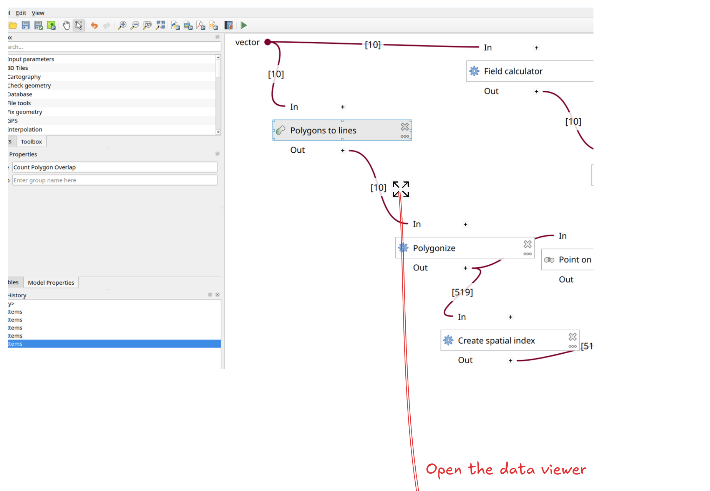
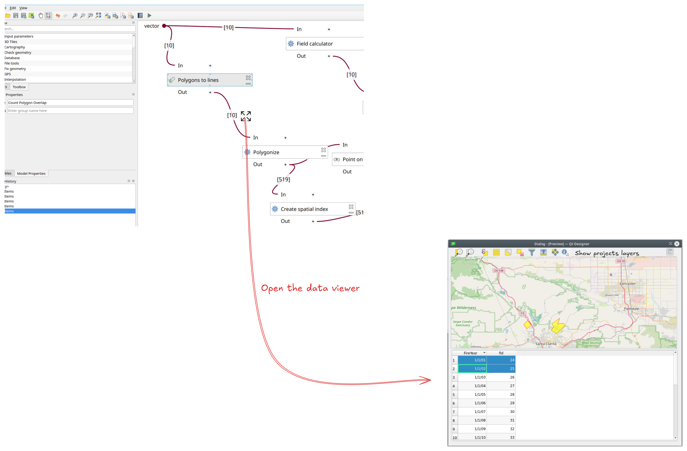
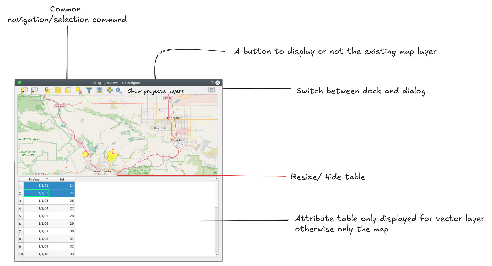
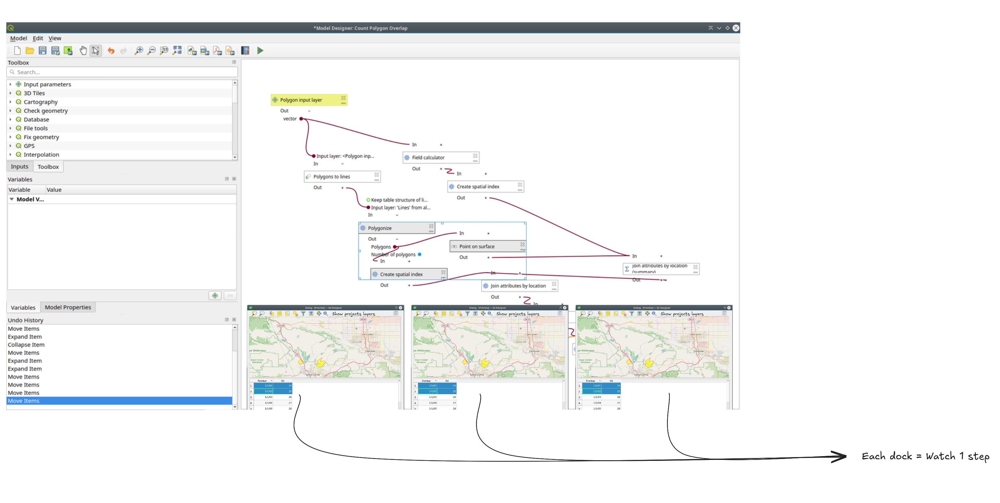
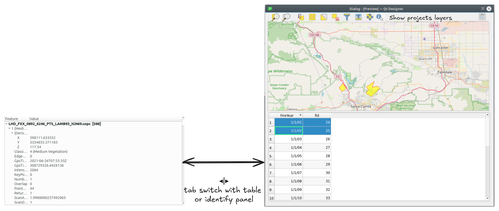
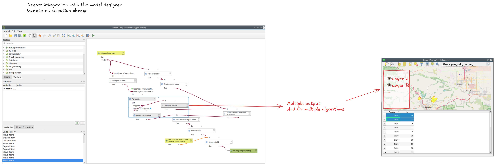

# QGIS Enhancement: Introduce a data viewer for the model designer

**Date** December 2025

**Author** Valentin Buira

**Contact** valentin at opengis dot ch

**maintainer** @ValentinBuira

**Version** QGIS 4.2

# Summary

Currently, debugging a model inside the model designer is cumbersome and involves multiple back and forths between your model designer and temporary output layer that you have to manage manually in your QGIS project.

We propose to introduce a new data viewer, that would be a dialog specialized to visualize and inspect intermediate step in a model. 

This dialog can then be turned into a dock. It will be composed of components already existing in QGIS, in order to speak the same language as the user, and reduce the overhead of code maintenance. 

This might seem like an easy feature to implement at first glance. What could go wrong it's just a `QDialog` and a `QgsMapCanvas` (*Right ?*). Yet it's also a tightrope walk exercise between providing a insightful peek of the data inside your model, and basically building QGIS onto itself in the model designer.

This QEP, try to be a good balance, in keeping thing simple yet relevant in the context of the model designer


## Presentation from the user perspective

### Invoking the data viewer

A new button positioned on the branch of the model will be added. With an icon meaning "Expand" it will invoke the data viewer in a new dialog window.



> **_NOTE:_**  The feature count on each branch will be part of QGIS 4.0 and is not part of this QEP




### Anatomy of the data viewer

Once invoked, the data viewer will have three main areas: the toolbar, the map canvas for a visual feedback and an attribute table for the details of data within this model step.



> **_NOTE:_**  The toolbar above, is only here as an example and does not reflect the final actions (see section underneath)

### The split between map canvas and attribut table

The attibut table and the map canvas are both present in the data viewer. They can be splitted and resized as user wish.

On top of it we will add some logics to make it seamless for the user:
*  On non geographic feature(e.g spreadsheet-like), only the attribute table while be displayed and the map canvas while be hidden.  While on the opposite side for non vector data but geographic feature, only the map canvas will be displayed and the attribute table will be hidden.
* Layer CRS will be used, and fallback to the project CRS if not available.  

### Focus on the toolbar

For a first iteration a good starting point would be to have: 

* Zoom to full extent
* Zoom map to selected rows
* Select all/ Invert / None
* *Toggle project layer* : Display or not the project layer in the map canvas
* *Add to the project*. If you have more complex data add the possibilty to fallback in the project to view them in full fledge QGIS.
* Short cut to hide or show the attribut table

The toolbar is flexible enough so it can be embellish later on with more tools. 

> **_NOTE:_**  The tools will only be enabled when it made sense to, exemple no need to have the select tool on raster data.

### Performance consideration of the attribut table

Temporary output may contains several thousand features, showing them all at once in the attribut table would bog down the responsiveness of QGIS.

We would limit the number of displayed to a certain number. A reasonable limit would be around ~1500 features. To counter act this artificial limitation, a new setting would be introduce for users wishing to increase the limit.  

We can hope this limitation is only temporary and that the attribut table refactor will bring us batch loading. 

# Proposed Solution

We propose to introduce a new specialized dialog, but keep it simple by using existing bricks of QGIS.

## A dockable dialog

Once the dialog is invoked it can then be docked, this way you can stack multiple intermediate steps at the same time, and watch then simultanously. 




You can think of it like a breakpoint in programming except it doesn't stop the execution of the model.


## Update on each run of the model

The data viewer will be updated on each new run of the model, so users will be able to monitor the change in their model at a certain branch. (`QgsProcessingAlgorithmDialogBase::algorithmFinished` signal can be used to achieve this)

Along the **dockable ability, update on each run, are really the salt of the data viewer**. because previously each time you outputed something to your project(e.g trought a temporary output). It was static and new temporary layer would be added each time you want to see your change to a model, effectively flooding your project with temporary layer all named the same.


> **_NOTE:_**  The data viewer will only be updated if the branch or the algorithm watched has not been deleted, otherwise it will be left blank.


### Note on the ownership of layers 

Since the results layers of a previous run is not stable (neither pointer nor layer id). The safer choice is to let the layer store handle the ownership of the temporary layers. And only query the layer using ` QgsProcessingUtils::mapLayerFromString`, the *child id* and the *output parameter name*. A more complete example can be found underneath.


Eventually we could clone the layer if we need to modify it. so we have the complete freedom over it. 

This would look roughly like this: 

```
QgsModelDesignerDialog::showDataViewerForChildOutput( const QString &childId, const QString &outputParamName )
{

    const QgsProcessingModelChildAlgorithmResult result = mLastResult.childResults().value( childId );
    const QVariantMap childAlgorithmOutputs = result.outputs();
    // Safe guard on childAlgorithmOutputs

    const QVariant output = childAlgorithmOutputs.value( outputParamName);
    // Safe guard on output Variant

    if ( QgsMapLayer *resultLayer = QgsProcessingUtils::mapLayerFromString( output.toString(), mLayerStore ) )
    {
        std::unique_ptr<QgsMapLayer> layer( resultLayer->clone() );
        // Optional have fun with this layer in the data viewer, and don't mess with the original layer in the layer store
    
    }
}
```

## Leverage existing capabilities of QGIS

One of the main strenghts of QGIS is the render engine along and all the utilities around the map canvas. So this QEP proposes to leverage the existings capabilities, both from end user perspective, and code wise.

### Widgets 

At least the following existing code would be used: 

* `QgsMapCanvas`
* `QgsAttributeTableView`

### Toolbars 

As with widgets, the actions in the toolbar at the top of the dialog will try as much as possible to reuse existing methods. For example, on the zoom to selection in the data viewer, the underlying function actually called will be `QgsMapCanvas::zoomToSelected` 
. New functions could be created if the existing one doesn't apply in this case.

<br>

The rest of the code to achieve the QEP is trivial to implement using standard Qt Framework, `QgsDockWidget`, and a new subclasses of `QgsModelDesignerFlatButtonGraphicItem` for the button responsible for opening the dialog on the model canvas.


## Further Considerations/Improvements


### Improve support for inspecting non vector data

While with the current approach, you can view any data supported in QgsMapCanvas. But inspecting the tabular data the attribut table only supports browsing vector data.

However, what does support inspecting other data type in QGIS is the Identify Results Panel. In a future iteration of the data viewer we could also have a Identify widget and they could switch with a stack widget with the attribut table could switch.

we could make a new convenience custom widget for this similar to what exists for the `QgsAttributeTableView` something like *QgsIdentifyResultsTreeView*. This widget could also be used in other areas of QGIS and external plugins as well. 




### Dynamic update with selected component

In this proposal, each data viewer dialog/dock is linked to only one output. We could imagine a more dynamic approach and more tied to the model current selection. 

For example:



## Backwards Compatibility

No breaking change

