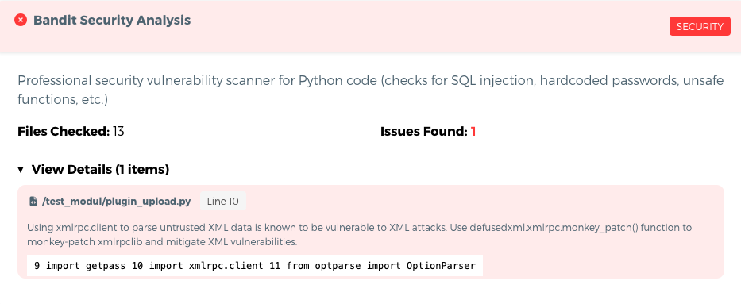
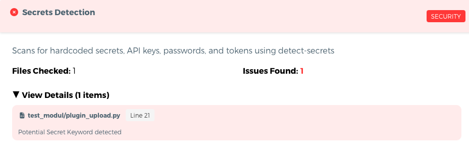
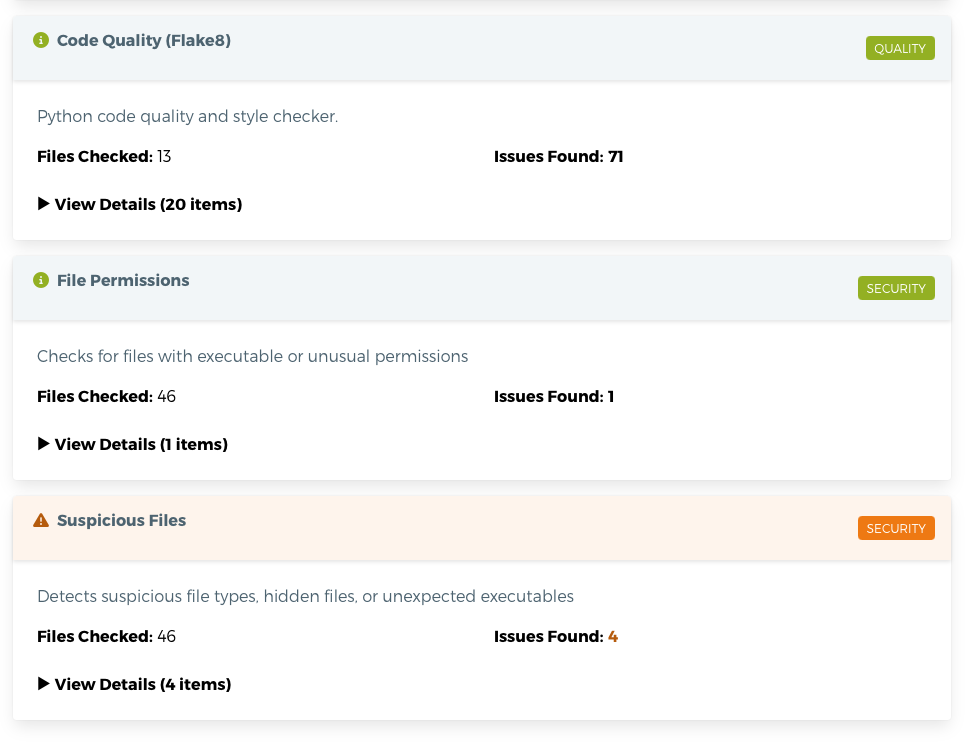

# QGIS Enhancement: Plugins Security and QA validator on plugins.qgis.org

**Date** 2026/01/20

**Author** Lova Andriarimalala (@Xpirix)

**Contact** lova at kartoza dot com

**Version** QGIS Plugins Website

# Summary

The QGIS Plugins Repository continues to grow and has recently surpassed 3,000 plugins, including those currently under review.

With this growth, it is increasingly important to strengthen our security measures and ensure that malicious or low-quality plugins are not distributed through QGIS infrastructure.

To address this, new Security and Quality Assurance (QA) checks have been introduced in the QGIS Plugins Website (see https://github.com/qgis/QGIS-Plugins-Website/pull/219). These checks are automatically executed synchronously during the upload process, similar to existing validators.

This QEP proposes to make these checks mandatory and blocking: any new plugin or plugin version that triggers at least one critical security issue will be immediately rejected and not published in the repository until the issue is resolved. By running the checks synchronously, no plugin with critical security issues will be uploaded to the QGIS infrastructure, ensuring that only secure plugins are available to users.

## New security and QA checks

There are currently five checks that will run when uploading a new plugin version:
- Bandit Security Analysis: Professional security vulnerability scanner for Python code (checks for SQL injection, hardcoded passwords, unsafe functions, etc.)
- Secrets Detection: Scans for hardcoded secrets, API keys, passwords, and tokens using detect-secrets
- Code Quality (Flake8): Python code quality and style checker.
- File Permissions: Checks for files with executable or unusual permissions
- Suspicious Files: Detects suspicious file types, hidden files, or unexpected executables

The result is detailed under the Plugin Version Details Page > Security Scan tab.
More details about these are available at https://plugins.qgis.org/docs/security-scanning

The proposition for now is to make the **Bandit Security Analysis** and **Secrets Detection** a blocking validator if at least one critical issue is found.

## Bandit Security Analysis

When a critical vulnerability issue or malicious code is found, this check will block a new plugin/version from being uploaded and show more details about it:

## Secrets Detection

When a hardcoded secret, API key... is found, this check will block a new plugin/version from being uploaded and show more details about it:

## Other checks
Code quality, file permissions and suspicious files checks will stay as non-blocking validators and be available on the Plugin Version Details Page > Security Scan tab.

## Risks

Some existing plugins will encounter the blocking validator when uploading a new version. However, we have implemented these checks as a soft validator, so they can be fixed and avoid being blocked later.

## Performance Implications

None

## Further Considerations/Improvements

### Email Notifications for Blocked Uploads

Since the security and QA checks run synchronously during the upload process (like existing validators), the plugin will not be uploaded if it has a critical security issue. An email notification will be sent to the plugin maintainer to inform them of the rejection. This is particularly important for:

- **Automated CI/CD Deployments**: Most plugin deployment processes are automated via CI, so developers may not see the HTML rejection page in the web interface and rely solely on the email notification to be informed of the blockage
- **Web Uploads**: Even for manual web uploads, email notifications provide a convenient record and reminder to address security issues before re-uploading

The email notification should include:
- Which check(s) failed (Bandit Security Analysis and/or Secrets Detection)
- Summary of critical issues found
- Guidance on how to resolve the issues and re-upload

### Future Enhancements

As the security and QA validation system matures, additional checks are planned to be added over time, including:

- **SPDX License Header Requirements**: Validation of proper license headers in source files
- **Binary Blob Detection**: Identification of unexpected binary files that may pose security risks
- **GPL Compliance Checks**: Verification of GPL license compliance and proper attribution
- **Additional Code Quality Metrics**: Extended static analysis and code quality validations

### Hybrid Validation Approach

As more checks are added to the system, a hybrid validation approach may be considered to balance security requirements with performance:

- **Synchronous (Blocking) Checks**: Critical security validations (Bandit, Secrets Detection, and future critical checks) that must pass before upload completes. This ensures no plugin with known critical security issues is ever uploaded to the infrastructure.

- **Asynchronous (Non-blocking) Checks**: Less critical validations (license compliance, code quality, documentation checks) that can run after upload and notify developers of issues without preventing initial publication.

This approach would maintain strong security guarantees while allowing for more comprehensive validation without impacting upload performance. The system would clearly distinguish between security-critical issues (immediate blocking) and quality/compliance issues (post-upload notifications).

## Issue Tracking ID(s)

https://github.com/qgis/QGIS-Plugins-Website/issues/213
