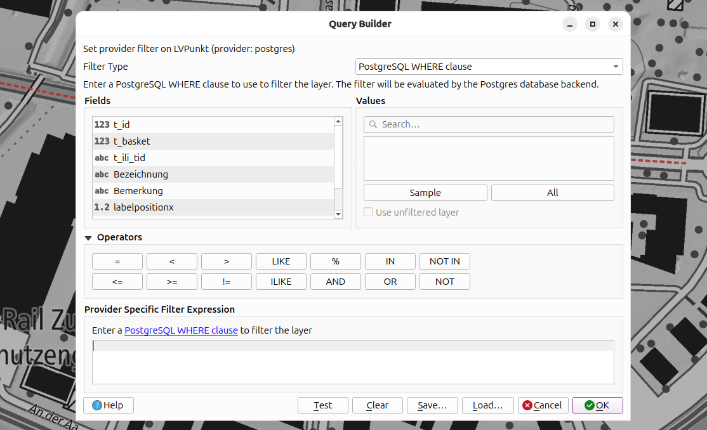
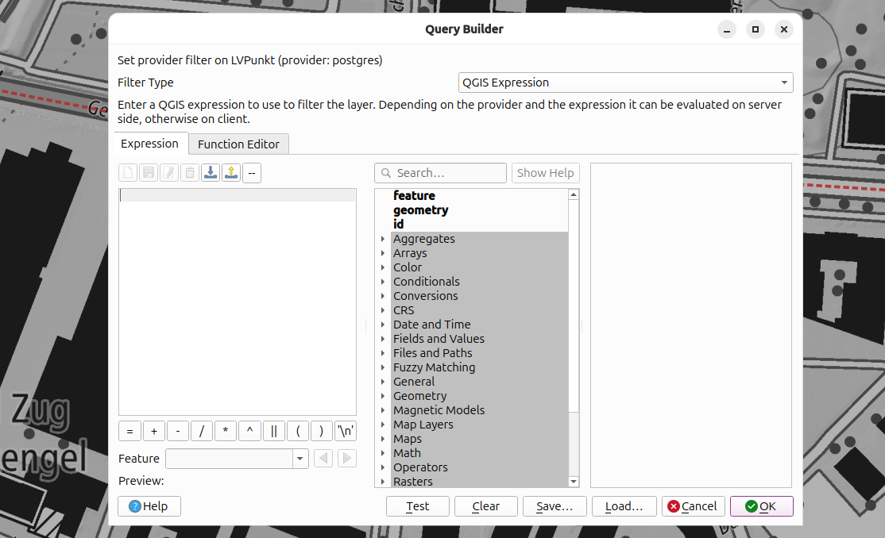

# QGIS Enhancement: Expression filter on vector layers

**Date** 2026/03/23

**Author** Dave Signer (@signedav)

**Contact** david at opengis dot ch

**Version** QGIS 4.2

# Summary

An expression filter similar to the query builder, accessible via *Layer > Filter*, where the entire layer can be filtered using expressions. You can choose between one of the filters. This enables us to filter all types of vector layers according to QGIS expressions and use elements such as variables, custom functions and more.

## Proposed Solution

### UX

You will be able to choose the filter type: "WHERE clause" or "QGIS Expression", while the "WHERE clause" can have additional info considering `QgsDataProvider::subsetStringDialect()`.

When "WHERE clause" is chosen, you will see the "traditional" query builder content (Mockup):



When "QGIS Expression" is chosen, you will see the expression builder where you can create your expression (Mockup):



This would include at least project and global scopes. 

We won't offer the combination of both. Even though it would be technically possible, it seems fairly fault-prone and hard to use. Using either one or the other seems right.

### Implementation

#### Set the subset expression

This subset expression will be set via layer `QgsVectorLayer::setSubsetExpression()` and provider `QgsDataProvider::setSubsetExpression()`, landing in the end in the `QgsAbstractFeatureSource` as member `mSubsetExpression`.

It is stored as custom property `QgsMapLayer::mCustomProperties['storedSubsetExpression']` (aligned with the `subsetString`).

#### Evaluate the expression

The client-side evaluation will be done in the `fetchFeature` method of the FeatureIterator:

```c++
bool fetchFeature( QgsFeature &f )
{
  mSource.subsetExpressionContext()->setFeature( f );
  if ( mSource.subsetExpression()->evaluate( mSource.subsetExpressionContext() ).toBool() )
    return true;
  return false;
}
```

Because it should not be implemented in every derived FeatureIterator, we implement it in a base class:

```c++
bool QgsAbstractFeatureIterator::fetchFeature( QgsFeature &f )
{
  if( privateFetchFeature( f ) )
  {
    mSource.subsetExpressionContext()->setFeature( f );
    if ( mSource.subsetExpression()->evaluate( mSource.subsetExpressionContext() ).toBool() )
      return true;
    
  }
  return false;
}
```

This means the current `fetchFeature` method is renamed to `privateFetchFeature`, as are all reimplemented `fetchFeature` methods in the derivatives.

#### Compile to server

On some providers, some expressions could be compiled to a query and evaluated on the server side. This would happen in the constructor of the provider-specific feature iterator.

This will be implemented at least for the PostgreSQL provider:

```c++
QgsPostgresFeatureIterator::QgsPostgresFeatureIterator( QgsPostgresFeatureSource *source, bool ownSource, const QgsFeatureRequest &request )
  : QgsAbstractFeatureIteratorFromSource<QgsPostgresFeatureSource>( source, ownSource, request )
{
  
  [...]

  QgsPostgresExpressionCompiler compiler = QgsPostgresExpressionCompiler( source);

  if ( compiler.compile( source.subsetExpression() ) == QgsSqlExpressionCompiler::Complete )
  {
    useFallbackWhereClause = true;
    fallbackWhereClause = whereClause;
    whereClause = QgsPostgresUtils::andWhereClauses( whereClause, compiler.result() );
    mSubsetExpressionCompiled = true;
  }

  [...]
```

And then in the `fetchFeature` method, we should only evaluate on the client side when it was not possible to compile:

```c++
bool QgsAbstractFeatureIterator::fetchFeature( QgsFeature &f )
{
  if( privateFetchFeature( f ) )
  {

    if( mSubsetExpressionCompiled ) 
        return true;
        
    mSource.subsetExpressionContext()->setFeature( f );
    if ( mSource.subsetExpression()->evaluate( mSource.subsetExpressionContext() ).toBool() )
      return true;
    
  }
  return false;
}
```

##### Optional preview in the GUI

Visual feedback would be very helpful in the GUI to know whether the expression can be compiled or not. However, this is not part of this enhancement.

#### Additional places to consider

##### Feature Count

For example, the feature count in the layer tree.

This can be integrated when we are able to compile the subset expression.

To do: This might need a count on the feature iterator.

##### Extend 

For example, via "Zoom to Layer(s)".

This can be integrated when we are able to compile the subset expression.

To do: I am not sure if we can provide this without uncontrollable performance impacts.

## Deliverables

- Expression filter on all vector layers
- Evaluation of compiled expressions on the server side with PostgreSQL

### Not delivered

The following are not part of this QEP:

- Compilation on providers other than PostgreSQL
- Optional preview in the GUI indicating whether it can be compiled (see above)

### Affected Files

- Files of QgsAbstractFeatureIterator and derivatives
- QgsVectorLayer files
- QgsQueryBuilder GUI files

## Risks

None

## Performance Implications

Maybe on extent or feature count.

## Further Considerations/Improvements

See the non-delivered parts above.

## Backwards Compatibility

Stored subset expressions will simply be ignored in older QGIS versions.