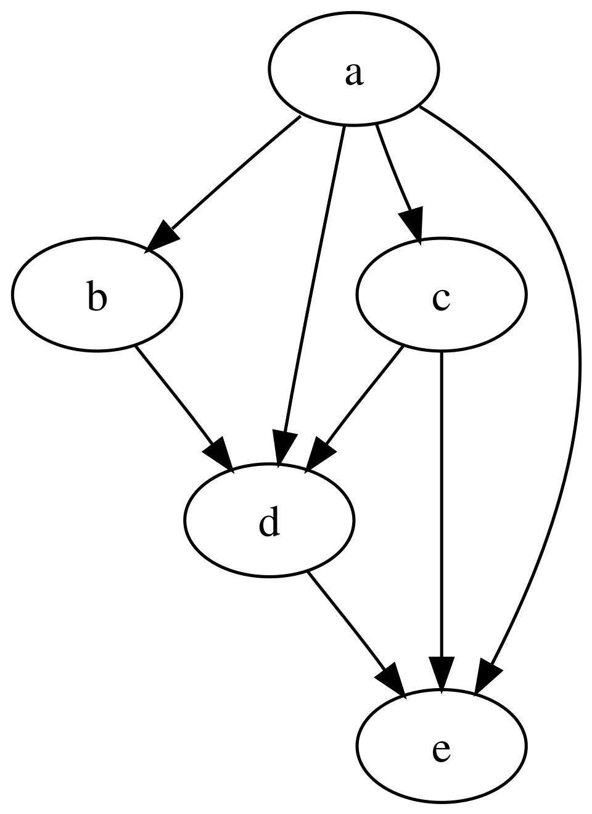

# QGIS Enhancement:  Refactor the evaluation of processing model with dependency graph

**Date** March 2026

**Author** Valentin Buira (@ValentinBuira)

**Contact** valentin at opengis dot ch

**Version** QGIS 4.4

## Summary

This QEP highlights some limitations with the internal data structure representation of the model in QGIS. And proposes a series of refactor based on results from graph theory and compiler theory, to _ensure the continuous improvement of the model designer_, and _bring some performance gains on completion of this QEP_.

With at the backbone of this proposal, the introduction of a dependency graph. 
 
**This QEP will be submitted as a QGIS grant** 


## Introduce a dependency graph 

### A dependency graph as a direct acyclic graph (DAG)


Currently all algorithms of a model are stored internally in a hashmap in the model class. And each stored child algorithm holds a list of its direct child dependency. The structure is mostly flat, there is no hierarchy in the way algorithms are stored in the models and dependencies are only known locally to one algorithm process.

We propose to introduce a direct acyclic graph(DAG) to represent the dependency between geoprocessing. *Why a DAG ?* Because a DAG is already the natural way of behaving in the models, when we modify a model, the code takes extra care to not introduce a dependency loop making it effectively a dag. 

But without the proper backend structure we don't get all the goodies and algorithms available in a dag data structure. As for example *Kahn's algorithm* for topological sort, that we will discuss in the next section. 


 
 <!-- align="right"/> -->


*Example of a direct acyclic graph (DAG)  in this example each node could be a processing algorithm* 


### Implementation of the dag 

I propose to store the graph with simple data structure and not create a new graph class. The graph would be stored in a dead simple adjacency list as:

`QMap< QString, QList< QString > > mChildAlgorithmGraph;`

Where the key would the childAlgorithm id and the QList the list of depends algorithms.


And when located in the code
```(diff)
+++ b/src/core/processing/models/qgsprocessingmodelalgorithm.h                                                                                     
@@ -614,6 +614,10 @@ class CORE_EXPORT QgsProcessingModelAlgorithm : public QgsProcessingAlgorithm                                                 
                                                                                                                                                  
    QMap< QString, QgsProcessingModelChildAlgorithm > mChildAlgorithms;                                                                           
                                                                                                                                                  
+    // Graph of child algorithm dependencies,                                                                                                    
+    // where the key is a child algorithm id, and the value is a list of child algorithm ids which depend on this child algorithm                 
+    QMap< QString, QList< QString > > mChildAlgorithmGraph;                                                                                       
+      
```


This introduction of the DAG will trickle down (in a good way) to some methods related to dependencies:

| Method  | Expected changes |
| ------------- | ------------- |
| `dependentChildAlgorithmsRecursive`  | All descendants of algorithms using standard BFS. instead of current implementation Mark parameter  QString &conditionalBranch as unused   |
| `dependentChildAlgorithms`  | Mark parameter  QString &conditionalBranch as unused   |
| `dependsOnChildAlgorithmsRecursive`  | Not Changed   |
| `dependsOnChildAlgorithms`  | Not Changed   |
| `availableDependenciesForChildAlgorithm`  | Not Changed   |


### Kahn’s algorithm for execution 

We propose to use the [kahn’s algorithm](https://en.wikipedia.org/wiki/Topological_sorting#Kahn%27s_algorithm) in  the execution of the model located in the method `QgsProcessingModelAlgorithm::processAlgorithm`. 

The Kahn’s algorithm is used for topological sorting. In graph theory a topological sort is a graph traversal in which each node is visited only after all its dependencies are visited. In QGIS this would ensure that every process is executed in the right order. 

This sort is suited for the sequential execution of chained operation like in our case

#### Current implementation (without graph structures) 

How does the execution work roughly in pseudocode (**some complexity regarding running only a subset, or  threading has been purposely omitted here**)

In pseudo code : 

```
While there is child algorithms not executed 
     Loop for each child algorithm not yet executed
            If all dependencies of the child algorithm are executed:
                    Execute algorithm and mark it as executed
            // if it’s a conditional branch prune child algorithm not yet executed when branch is falsy
```

In current implementation, every child algorithm is checked at each iteration, and we hope for the best that they are somehow sorted in the right order. In worst case scenario this as an algorithm with polynomial complexity where n is the number of child algorithm 
  
#### Proposed implementation ( With graph structures and kahn’s algorithm)

Kahn’s algorithm in pseudo code adapted in QGIS context   (**again complexity regarding running only a subset, or  threading has been purposely omitted here, but would be implemented as well**)


```
L ← Empty list that will contain the sorted elements
ChildAlgSet ← Set of all nodes with no incoming edge

while ChildAlgSet is not empty do
   
    remove a node n from ChildAlgSet
   Execute child algorithm
    add n to L
    for each node m with an edge e from n to m do
        remove edge e from the graph
        if m has no other incoming edges then
            insert m into ChildAlgSet

if graph has edges then
    // Should never happen
    return error   (graph has at least one cycle)
```


The kahn algorithm in a dag has  a complexity of O(V + E), where V is the number of vertices (child algorithm here) and E is the number of edges (here child algorithm dependency)  in the graph.


_As you can see the pruning logic is not needed anymore as we only visit the minimum necessary dependencies at each step._


### Key benefits

The benefits of a dependency graph, go well beyond the improvements of this QEP, but cover wide areas of improvements 

* Simplify the code

remove convoluted code for pruning branches. 
With Kahn's algorithm, there is no need to have a logic to prune branches as they are simply not visited.

* Performance, execution speed


kahn’s algorithm offers already better performance than the current implementation, but the kahn’s algorithm can also be adapted to be parallelized to compute independent branches concurrently. 

*Schutte, J. (2013). Implementing Parallel Topological Sort in a Java Graph Library [Master's thesis, University of Twente].*

Moreover, once we have a DAG data structure, a plethora of algorithms and optimizations are available to us. For example: transitive graph reductions, Sub tasking, disjoint path for concurrent execution

*Slim Ben-Amor, Liliana Cucu-Grosjean. Graph reductions and partitioning heuristics
for multicore DAG scheduling. Journal of Systems Architecture, 2022, 124, pp.102359.
 10.1016/j.sysarc.2021.102359 .  hal-03538053*

* Performance on memory by flushing intermediate output from memory

In some case ( lengthy models or large datasets ) we can hit a memory bottleneck.

Because unlike topological sorts the current implementation has no idea of the dependency so it keeps every temporary output results in memory just in case it’s still needed later on during the execution.

With a DAG and the kahn’s algorithm we could flush temporary output as soon as a process is executed. If we take the pseudo code above and  adding the flushing logic this would look like this 

    add n to L
    for each node m with an edge e from n to m do
        remove edge e from the graph
        if m has no other incoming edges then
             insert m into ChildAlgSet
    ++ flush temporary results from n

Now in the context of the model designer for debugging purposes it can be useful to keep temporary output, but we could imagine a toggle, to favor debug or performance.  

* Fix export to python 

Once we have a working implementation in the processAlgorithm method. It’s easier to also adopt the Kahn's algorithm to the method responsible for exporting a model to python(  `QgsProcessingModelAlgorithm::asPythonCode`) As the kahn’s algorithm does not flatten if statements it would fix export to python in  every model that use branching logic (see ticket #49053). 

Although a [depth first search  variation of the Kahn's algorithm](https://en.wikipedia.org/wiki/Topological_sorting#Depth-first_search) should be used because in this case not only the order of execution matters, but also the block indent order needs to be taken into consideration.


## Deliverables 

At the completion of this QEP, all the internal algorithms of a model will be stored inside a graph data structure (a DAG). Methods that today dealt with dependency will be updated accordingly to use the new data structures.

And the method responsible for the execution, will be speed up using Kahn's algorithm

The complexity of the code base should decrease as we match more naturally the implicit DAG-like behavior of the processing model with an actual DAG underlying data structure. 

The only user facing changes is an increase of performance and execution speed when running a processing model. 


### Affected files 

src/core/processing/models/qgsprocessingmodelalgorithm.h
src/core/processing/models/qgsprocessingmodelalgorithm.cpp

## Risks

Low, all the changes are internal to the model and not exposed through the API. 