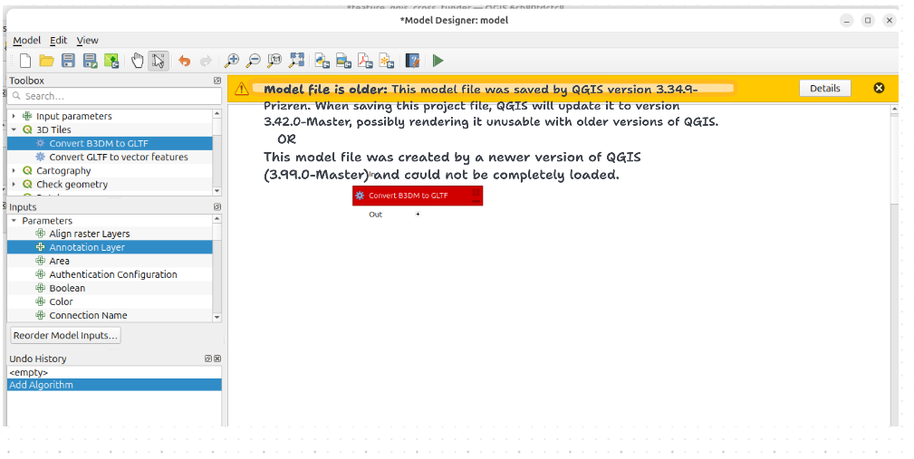

# QGIS Enhancement: Better versioning for ".model3" file

**Date** April 2026

**Author** Valentin Buira (@ValentinBuira)

**Contact** valentin at opengis dot ch

**Version** QGIS 4.4

## Summary

QGIS uses a “.model3” file format for storing models created using the model designer. The “.model3” despite the extension name is just an xml document under disguise.

While QGIS is evolving the “.model3” file remains static. This lead to multiple problems:


* Deprecated or renamed parameters like  https://github.com/qgis/QGIS/commit/5bde6fec42ccc10b9fd1c4fc822fbe1a4ae05a30#diff-1a68bfeb89b1356e8ae1095b1d3576c138b2809adde3dbd2a123819c2b3a33b6R108, break the model. the idea of this QEP actually emerged after I wanted to change the type of an output from string to CRS.
* Open a model with a feature added in later version of QGIS is broken, for example you open a model made in QGIS 3.44 that use [repeat expression](https://qgis.org/project/visual-changelogs/visualchangelog344/#feature-add-repeat-function-and-reverse-variant-for-strings) in QGIS 3.40, same could be said for any new processing algorithms


Both case silently broke the model open, without a clear warning.

And in the first case, _we effectively silently break the promise of backward compatibility when it comes to the processing model._ 

This QEP proposes to reestablish the promise of backward compatibility in the model designer. And conveniently introduce a framework for a better versioning in the “.model3” and allow us to make the format evolving as much as we want. 

For example one thing that is missing in the “.model3” format is the dependency to plugins. If a model is using an algorithm from a plugin and the plugin is not installed. The only information we have is the name of the provider of the plugin. 


**We would like to introduce the change as soon as possible, so we aim for 4.4 or 4.2 if possible. It’s kinda a situation of “The best time to do it was 5 years ago, the second best time is now”**

## Proposed Solution

We propose to introduce new information about the QGIS version the model was made in directly inside the “.model3” format. The idea is directly drawn from the existing logic around the .qgs file format. 


## A sense of déjà vu ? 

From the perspective of the user, the UI will be very similar of the warning already existing when opening a QGIS project (same terminology, color code, in message bar, on open). And similar to the project. Saving could effectively change the “.model3” file.

**When loading a model created in a new version** :  “This model file was created by a newer version of QGIS (4.XX.X) and could not be completely loaded.”

**When loading a model created in a previous version** : “Model file is older: This model file was saved by QGIS version 4.XX.X. When saving this model file, QGIS will update it to version 4.XX.X, possibly rendering it unusable with older versions of QGIS.”

_quick'n dirty mockup to give a rough idea how that would look_ 



## A new key information the QGIS version

A new entry will be introduced in the file format corresponding to the version( i.e `Qgis::version()` ) in which the model was last saved. This version information will serve as the pivot point to know how to load the model file. 


> To note the “.model3” file format already went to a format change around QGIS 3.26, as you can see with the enum `QgsProcessingModelAlgorithm::InternalVersion`. But only regarding the structure of the documents and not the version of QGIS.

## Versioning code 

`QgsProcessingModelAlgorithm::fromVariant` in this method the actual magic will appear, while reading the “.model3”, the map parsing will do as many transformations as needed until it matches the QGIS version and the state of the “model3”

It is also at this that the warning message (described in previous paragraph) will be chosen, and reported to the model designer dialog to be displayed. 


Example of versioning code in pseudocode that would be added in `QgsProcessingModelAlgorithm::loadVariant` at line ~1765

```
 
   mInternalVersion = qgsEnumKeyToValue( map.value( u"internal_version"_s ).toString(), InternalVersion::Version1 );
 
+  const QgsProjectVersion fileVersion( qgsEnumKeyToValue( map.value( u"qgis_version"_s ).toString(), "3.XX.X-Solothurn" ); );
+  const QgsProjectVersion thisVersion( Qgis::version() );
+  
+  if ( thisVersion > fileVersion )
+  {
+
+     infotext  = tr(
+                          "Model file is older: This model file was saved by QGIS version 4.XX.X.
+                          When saving this model file, QGIS will update it to version 4.XX.X, 
+                          possibly rendering it unusable with older versions of QGIS"
+    )
+                          .arg( projectVersion, Qgis::version() );
+
+    
+    push the info about the model version to the user 
+
+    if (fileVersion < version 3.44): 
+      //  Transform from old version to new version
+          fileVersion = fileVersion 4.0
+    
+    if (fileVersion <  version 4.2):
+      //  Transform from version 4 to version 4.2
+
+      fileVersion = thisVersion
+
+    // As much if statements as there is change in the ".model3" file format
+    
+  }
+  else if (thisVersion < fileVersion )
+  {
+    visibleMessageBar()->pushWarning( QString(), tr( "This project file was created by a newer version of QGIS (%1) and could not be completely loaded." 
).arg( projectVersion ) );
+  }
+  else
+  {
+    // versions match - nothing to do 
+  }
+  
+  // Parse normally from here on once we ensure we have a version the latest version of the file format
+
   mVariables = map.value( u"modelVariables"_s ).toMap();
   mDesignerParameterValues = map.value( u"designerParameterValues"_s ).toMap();
```


Finally QgsProcessingModelAlgorithm::toVariant will be updated to always save into the “.model3” the current version of QGIS, and the format supported by this version.


## Continuous process

From now on, for each release where we make breaking changes to the model in QGIS we would have to add a new versioning condition. This would be ensured during review of processing related PR. 

## Deliverables

At the completion of the QEP, QGIS would have a new versioning code to ensure “.model3” stays in sync with the evolution of QGIS. A new warning in case a user attempts to open a “.model3” file made for a newer version of QGIS. 

And of course, the newly added code will ensure that the known breaking changes to the “.model3” as of today will be dealt with. 


### Affected Files

* src/core/processing/models/qgsprocessingmodelalgorithm.cpp (For the versioning )
* src/gui/processing/models/qgsmodeldesignerdialog.cpp (For the user feedback )

## Risks

None 
