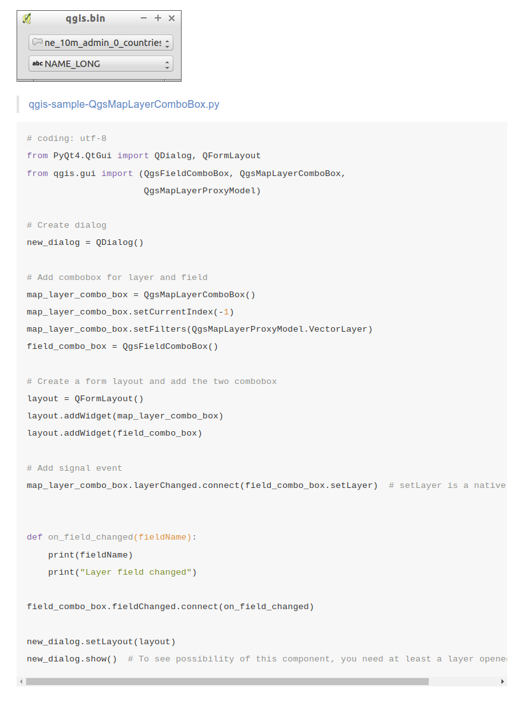
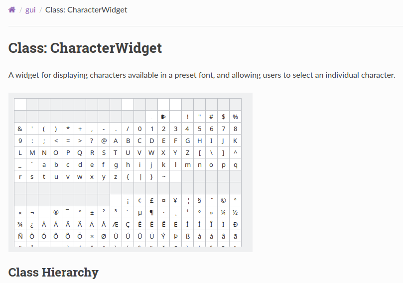
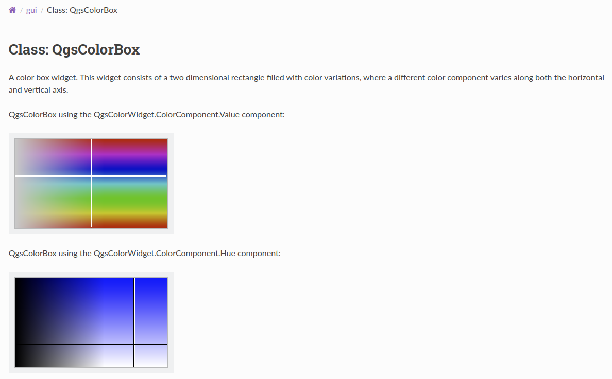
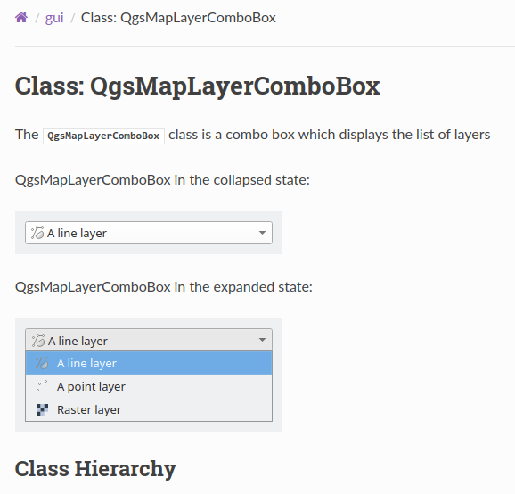

# QGIS Enhancement 333: Adding screenshots to PyQGIS documentation

**Date** 2025-02-025

**Author** Nyall Dawson (@nyalldawson)

**Contact** nyall.dawson@gmail.com

**Version** QGIS 3.44-3.46

# Summary

Thanks to a concentrated effort over the last couple of years, the [PyQGIS reference documentation](https://qgis.org/pyqgis/master/index.html)
has improved substantially. It's now a valuable, Python-developer friendly, reference, presented
in a modern, sleek format.

That said, there's still much room for further improvements in the documentation!

A previously valuable resource for PyQGIS developers was the (unofficial) "PyQGIS samples"
site at https://webgeodatavore.github.io/pyqgis-samples/index.html. This site
included some great content, including screenshots and example code for many PyQGIS classes.
For example, here's what the site includes for the ``QgsMapLayerComboBox`` class:



Unfortunately, this site is outdated and has not been updated for either QGIS 3.x or Qt 5,
and accordingly is no longer a valuable resource. This is a shame, as the example
screenshots helped PyQGIS developers find the right GUI classes for their code, and
the example code was a fantastic starting point for working with each class.

This proposal seeks to partially port the content from the webgeodatavore site over to
the official PyQGIS Reference Guide, specifically the screenshot component only.

## Proposed Solution

The old webgeodatavore site utilised manual screenshots of widgets. A manual approach
has a number of issues:

- It requires pro-active updates whenever a QGIS widget is modified and changes appearance.
  This results in a tendency for screenshots to include outdated appearance.
- Screenshots have a variety of styles. Some are taken on different operating systems, some
  have different Qt themes and color schemes. This looks inconsistent and amateurish.
- It's basically impossible for QGIS developers to add new screenshots for newly created
  widgets with a consistent appearance as the existing images in the documentation.

Accordingly, screenshots for widgets will instead be created dynamically, as part of the
PyQGIS documentation build process. This ensures:

- Widget screenshots are ALWAYS up to date with the corresponding QGIS version for the
  documentation.
- Widgets will ALWAYS have a consistent theme, font, sizing and general appearance.
- It will be simple to e.g. change the Qt theme or stylesheet and have all screenshots
  regenerated to match.

To facilitate this, the [generate_docs](https://github.com/qgis/pyqgis-api-docs-builder/blob/main/scripts/make_api_rst.py#L294)
method from [scripts/make_api_rst.py](https://github.com/qgis/pyqgis-api-docs-builder/blob/main/scripts/make_api_rst.py) will be
modified to include an extra component in the generated class headers:

``` py
header += generate_screenshot(package, class_name, _class)
```

Where ``generate_screenshot`` is defined as follows:

``` py
def generate_screenshot(package, class_name: str, _class) -> str:
    """
    Generates screenshots for a class, and returns corresponding markdown
    """
    module_name = package.__name__.split('.')[-1]
    script_path = Path(__file__).parent / '..' / 'screenshots' / module_name / (class_name.lower() + '.py')
    if not script_path.exists():
        return ""

    image_path = Path(__file__).parent / '..' / 'api' / 'master' / module_name
    spec = importlib.util.spec_from_file_location('script', script_path)
    executed_module = importlib.util.module_from_spec(spec)
    spec.loader.exec_module(executed_module)
    func = getattr(executed_module, 'generate_screenshot')
    return func(image_path)
```

This function checks whether a Python file matching the current class name exists in the
``screenshots/{module name}`` folder in the ``pyqgis-api-docs-builder`` repository. For
example, if the current class is ``QgsMapLayerComboBox`` from the ``gui`` module, the
function checks whether ``screenshots/gui/qgsmaplayercombobox.py`` exists. If so,
it dynamically loads it and executes the ``generate_screenshot`` method from that file.

The ``generate_screenshot`` method must have the signature:

``` py
def generate_screenshot(dest_path: Path) -> str:
    """
    Generates screenshots for the class.
    
    Screenshots should be stored in the dest_path folder.
    
    The method should return the corresponding markdown to include in the class
    header, containing `.. image:: filename.png` tags as desired.
    
    Multiple images may be generated and included in the returned markdown. 
    """
```

To assist with screenshot generation, a new ``ScreenshotUtils`` class will be added
to the repository. This class will contain static methods for helping with screenshots,
e.g.

``` py

class ScreenshotUtils:

    @staticmethod
    def capture_widget(widget: QWidget, width=300, height=None) -> QImage:
        """
        Captures the specified widget, using consistent margins and appearance.
        
        Returns the captured QImage.
        """
    
    @staticmethod
    def capture_combobox_with_dropdown(combo: QComboBox, width=300) -> QImage:
        """
        Captures a QComboBox widget with the combo box popup in an expanded state.
        
        The resultant capture will be sufficiently high to include all of the combo box entries.
        
        Returns the captured QImage.
        """
```

## Examples

### CharacterWidget

To generate a screenshot for the [CharacterWidget](https://qgis.org/pyqgis/master/gui/CharacterWidget.html) class,
the ``screenshots/gui/characterwidget.py`` file will be:

``` py
from pathlib import Path
from qgis.gui import CharacterWidget
from screenshots.utils import ScreenshotUtils

def generate_screenshot(dest_path: Path):
    widget = CharacterWidget()

    im = ScreenshotUtils.capture_widget(widget, width=490, height=320)
    im.save((dest_path / 'characterwidget.png').as_posix())

    return ("\n.. image:: characterwidget.png\n")
```

The resultant documentation page looks like this:




### QgsColorBox

To generate multiple screenshots for the [QgsColorBox](https://qgis.org/pyqgis/master/gui/QgsColorBox.html) class,
the ``screenshots/gui/qgscolorbox.py`` file will be:

``` py
from pathlib import Path
from qgis.gui import QgsColorBox, QgsColorWidget
from screenshots.utils import ScreenshotUtils

from qgis.PyQt.QtGui import QColor

def generate_screenshot(dest_path: Path):
    widget = QgsColorBox()
    widget.setColor(QColor(100, 150, 200))

    im = ScreenshotUtils.capture_widget(widget, width=320, height=320)
    im.save((dest_path / 'color_box_value.png').as_posix())

    widget.setComponent(QgsColorWidget.ColorComponent.Hue)
    widget.setColor(QColor(150, 150, 200))
    im = ScreenshotUtils.capture_widget(widget, width=320, height=320)
    im.save((dest_path / 'color_box_hue.png').as_posix())

    return ("\nQgsColorBox using the QgsColorWidget.ColorComponent.Value component:\n\n.. image:: color_box_value.png\n" +
            "\nQgsColorBox using the QgsColorWidget.ColorComponent.Hue component:\n\n.. image:: color_box_hue.png\n")
```

The resultant documentation page looks like this:




### QgsMapLayerComboBox

To generate multiple screenshots for the [QgsMapLayerComboBox](https://qgis.org/pyqgis/master/gui/QgsMapLayerComboBox.html) class,
the ``screenshots/gui/qgsmaplayercombobox.py`` file will be:

``` py
from pathlib import Path
from qgis.core import (
    QgsProject,
    QgsVectorLayer,
    QgsRasterLayer
)
from qgis.gui import QgsMapLayerComboBox
from screenshots.utils import ScreenshotUtils


def generate_screenshot(dest_path: Path):
    layer = QgsVectorLayer('Point', 'A point layer', 'memory')
    layer2 = QgsVectorLayer('Line', 'A line layer', 'memory')
    raster = QgsRasterLayer('x', 'Raster layer')

    QgsProject.instance().addMapLayers([layer, layer2, raster])

    combo = QgsMapLayerComboBox()

    im_collapsed = ScreenshotUtils.capture_widget(combo)
    im_collapsed.save((dest_path / 'qgsmaplayercombobox_collapsed.png').as_posix())

    im_expanded = ScreenshotUtils.capture_combo_with_dropdown(combo)
    im_expanded.save((dest_path / 'qgsmaplayercombobox_expanded.png').as_posix())

    return ("\nQgsMapLayerComboBox in the collapsed state:\n\n.. image:: qgsmaplayercombobox_collapsed.png\n" +
            "\nQgsMapLayerComboBox in the expanded state:\n\n.. image:: qgsmaplayercombobox_expanded.png\n")
```

The resultant documentation page looks like this:




## Deliverables

- The framework for the screenshot generation, as described above
- Screenshot generation code for common GUI widget classes. Given that there are around 700
  GUI widget classes in QGIS, not all classes will initially have screenshots added. For the
  QGIS 2025 grant we will commit to add screenshots for the **100 most commonly used widgets** only.

## Risks

Low. The approach has already been tested and verified to work as described.

## Performance Implications

- Generating the PyQGIS documentation will take longer, but this is an automated process
  and does not involve any user/developer time.
